Getting Started: Diamonds
================
Angela Sharer
2020-

  - [Grading Rubric](#grading-rubric)
      - [Individual](#individual)
      - [Team](#team)
      - [Due Date](#due-date)
  - [Data Exploration](#data-exploration)
  - [Communication](#communication)

*Purpose*: Throughout this course, you’ll complete a large number of
*exercises* and *challenges*. Exercises are meant to introduce content
with easy-to-solve problems, while challenges are meant to make you
think more deeply about and apply the content. The challenges will start
out highly-scaffolded, and become progressively open-ended.

In this challenge, you will go through the process of exploring,
documenting, and sharing an analysis of a dataset. We will use these
skills again and again in each challenge.

<!-- include-rubric -->

# Grading Rubric

<!-- -------------------------------------------------- -->

Unlike exercises, **challenges will be graded**. The following rubrics
define how you will be graded, both on an individual and team basis.

## Individual

<!-- ------------------------- -->

| Category    | Unsatisfactory                                                                   | Satisfactory                                                               |
| ----------- | -------------------------------------------------------------------------------- | -------------------------------------------------------------------------- |
| Effort      | Some task **q**’s left unattempted                                               | All task **q**’s attempted                                                 |
| Observed    | Did not document observations                                                    | Documented observations based on analysis                                  |
| Supported   | Some observations not supported by analysis                                      | All observations supported by analysis (table, graph, etc.)                |
| Code Styled | Violations of the [style guide](https://style.tidyverse.org/) hinder readability | Code sufficiently close to the [style guide](https://style.tidyverse.org/) |

## Team

<!-- ------------------------- -->

| Category   | Unsatisfactory                                                                                   | Satisfactory                                       |
| ---------- | ------------------------------------------------------------------------------------------------ | -------------------------------------------------- |
| Documented | No team contributions to Wiki                                                                    | Team contributed to Wiki                           |
| Referenced | No team references in Wiki                                                                       | At least one reference in Wiki to member report(s) |
| Relevant   | References unrelated to assertion, or difficult to find related analysis based on reference text | Reference text clearly points to relevant analysis |

## Due Date

<!-- ------------------------- -->

All the deliverables stated in the rubrics above are due on the day of
the class discussion of that exercise. See the
[Syllabus](https://docs.google.com/document/d/1jJTh2DH8nVJd2eyMMoyNGroReo0BKcJrz1eONi3rPSc/edit?usp=sharing)
for more information.

``` r
library(tidyverse)
```

    ## ── Attaching packages ───────────────────────────────────────── tidyverse 1.3.0 ──

    ## ✓ ggplot2 3.3.2     ✓ purrr   0.3.4
    ## ✓ tibble  3.0.1     ✓ dplyr   1.0.0
    ## ✓ tidyr   1.1.0     ✓ stringr 1.4.0
    ## ✓ readr   1.3.1     ✓ forcats 0.5.0

    ## ── Conflicts ──────────────────────────────────────────── tidyverse_conflicts() ──
    ## x dplyr::filter() masks stats::filter()
    ## x dplyr::lag()    masks stats::lag()

# Data Exploration

<!-- -------------------------------------------------- -->

In this first stage, you will explore the `diamonds` dataset and
document your observations.

**q1** Create a plot of `price` vs `carat` of the `diamonds` dataset
below. Document your observations from the visual.

*Hint*: We learned how to do this in `e-vis00-basics`\!

``` r
## TASK: Plot `price` vs `carat` below

ggplot(diamonds) +
  geom_point(mapping = aes(x = carat, y = price)) +
  labs(title = "Diamond prices vs. carat values")
```

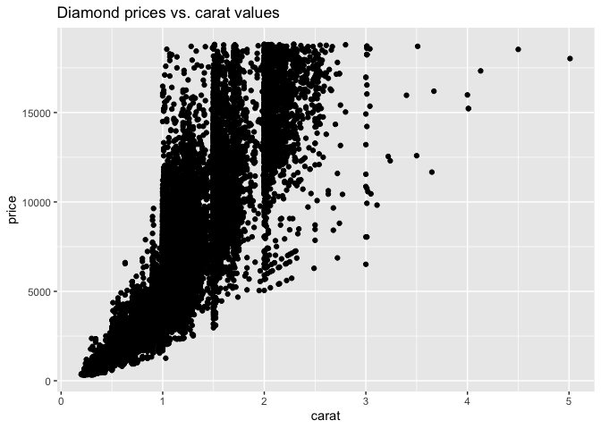<!-- -->

**Observations**:

  - As one might expect, a higher carat value means, roughly, that the
    price of the diamond will be higher, but with variation due
    (probably) to those other “C” variables: clarity, color, and cut.
  - There is some interesting clustering happening though, with a lot
    more diamonds falling right above 2 carats than right below, it
    seems. When I did the first exercise, I wrote, “This makes me wonder
    how carats work, OR if there is something about this dataset that
    would have selected for these differently…” But now that I have read
    the Wikipedia bit about “carat over cut,” I see that there is a lot
    more human intervention in determining the carat value than I would
    have otherwise guessed. For whatever reason (ease of filtering? A
    human tendency to discount fractional values like 1.1 as “basically
    1”–and thus not worth an increased price over a 1 carat diamond?),
    it seems that the people who cut diamonds are optimizing for carat
    values of 1, 1.5, 2, etc.–or very close to those values, anyway.
  - There seems to be some clipping happening with the price, as well–I
    would guess this dataset pulled a set of diamonds under a particular
    price point, or a set of diamonds starting with the least expensive
    and ending at a certain number of diamonds (53,940?). I know they
    can cost more than $20k in the real world…

**q2** Create a visualization showing variables `carat`, `price`, and
`cut` simultaneously. Experiment with which variable you assign to which
aesthetic (`x`, `y`, etc.) to find an effective visual.

``` r
## TASK: Plot `price`, `carat`, and `cut` below

ggplot(diamonds) +
  geom_point(mapping = aes(x = carat, y = price, color = cut)) +
  labs(title = "Diamond prices vs. carat values and cuts")
```

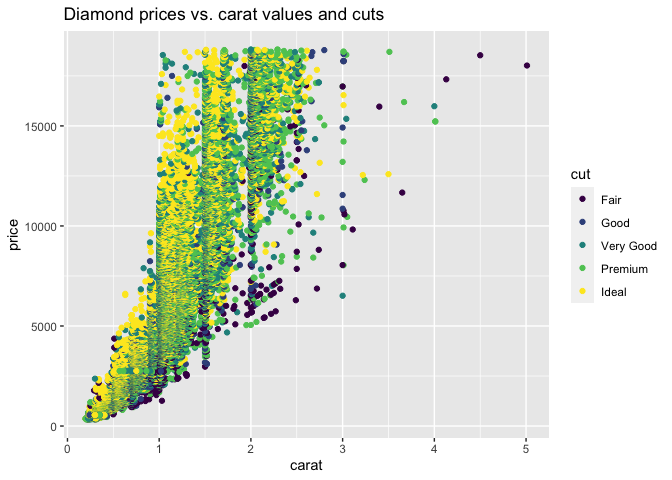<!-- -->

``` r
#ggplot(diamonds) +
#  geom_boxplot(mapping = aes(x = cut, y = carat))
```

**Observations**:

Before I learned about the way carats are prioritized, I wrote the
following:

  - Obviously cut also has a relationship to price–the better the cut
    (for a given carat value), generally the higher the price.
  - But, there are a lot of points (it seems) that do not clearly fit
    this pattern…

But now,

  - It does seem that Ideal cuts are more concentrated in the
    lower-carat diamonds, and poorer quality cuts dominate the
    higher-carat diamonds.

Additionally, I have questions\!

**First, am I correct that there is clustering around integer carat
values, and around 1.5 carats?**

``` r
carat_vector <- diamonds$carat
hist(x = carat_vector, breaks = 20)
```

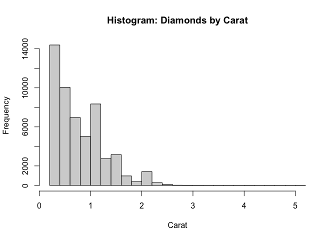<!-- -->

**Observations**:

  - This confirms my suspicion about the clustering of diamonds around
    carat values of 1, 1.5, and 2.
  - However, the resolution is a bit low (and I may not be doing my
    histogram correctly, but I can’t seem to get more than 4 breaks per
    carat here)…

**Are there other clusters in the lower-carat value diamonds?**

``` r
diamonds_up_to_2 <- filter(diamonds, carat <= 2)
carat_vector_up_to_2 <- diamonds_up_to_2$carat
hist(x = carat_vector_up_to_2, breaks = 24) 
```

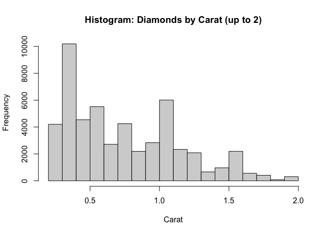<!-- -->

``` r
ggplot(diamonds_up_to_2) +
  geom_point(mapping = aes(x = carat, y = price, color = cut)) +
  labs(title = "Diamond price by carat (up to 2) and cut")
```

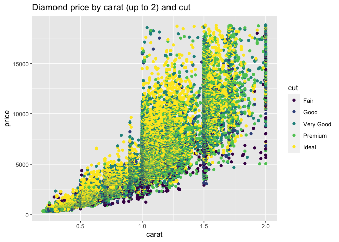<!-- -->

**Observations**:

  - Yes, I think I am seeing multiple clusters when I look more closely
    at the lower-carat value diamonds. There is very clearly one around
    0.3 carats (I wonder if this is a good carat weight for e.g. pave
    diamonds?), probably one around 0.5 carats, and another at 0.7
    carats (or so; I’m not being terribly precise here).
  - The shape of this histogram is not what I would have guessed before
    I learned about how the carat value of a diamond is determined. (I
    would have expected a normal distribution, I think, not all these
    spikes.)

**Next, what’s happening above 2 carats?**

``` r
diamonds_2plus <- filter(diamonds, carat >= 2)
carat_vector_2plus <- diamonds_2plus$carat
hist(x = carat_vector_2plus, breaks = 24)
```

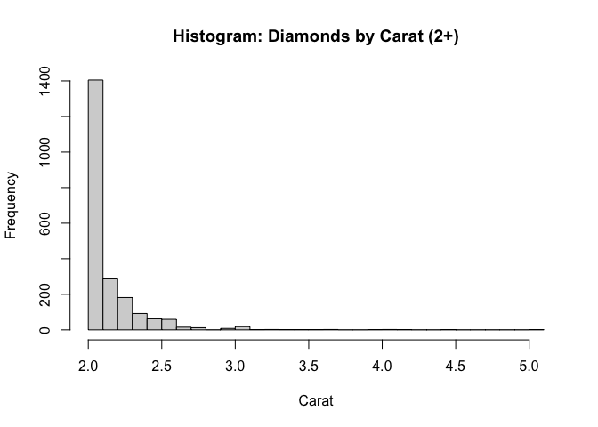<!-- -->

There are not many diamonds with a carat value higher than 3 in this
dataset. Let’s set those aside and focus on the 2-3 carat diamonds.

``` r
diamonds_2_to_3 <- filter(diamonds, carat >= 2 & carat <= 3)
carat_vector_2_to_3 <- diamonds_2_to_3$carat
hist(x = carat_vector_2_to_3, breaks = 20)
```

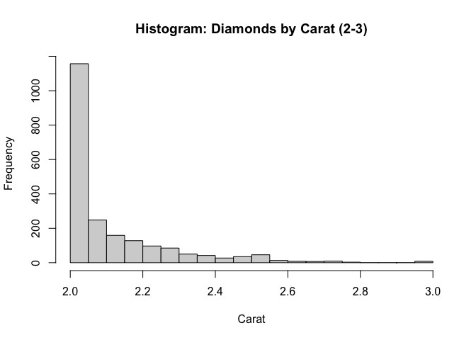<!-- -->

**Observations**:

  - In my histogram, I see the cluster of diamonds at 2 carats, and it
    looks like I do have a smallish cluster at 2.5, but this is so
    subtle as to perhaps be noise–the trend seems stronger in the 1-2
    carat diamonds. Hypothesis: Above 2 carats, you might as well go up
    to 3, psychologically speaking? But when you’re in the normal-people
    range of less than 2 carats, 1.5 is a substantial jump from 1, and
    thus feels more worthwhile…?

**But what about cut? If I filter the dataset by cut, do other patterns
emerge?**

``` r
ideal_diamonds <- filter(diamonds, cut == "Ideal")
ggplot(ideal_diamonds) +
  geom_point(mapping = aes(x = carat, y = price)) +
  labs(title = "Ideal cut diamonds: prices vs. carat values") +
  xlim(0,5.01)
```

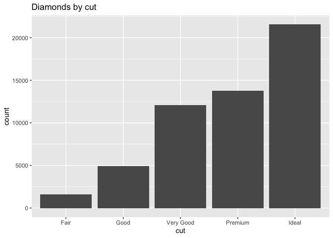<!-- -->

``` r
premium_diamonds <- filter(diamonds, cut == "Premium")
ggplot(premium_diamonds) +
  geom_point(mapping = aes(x = carat, y = price)) +
  labs(title = "Premium cut diamonds: prices vs. carat values") +
  xlim(0,5.01)
```

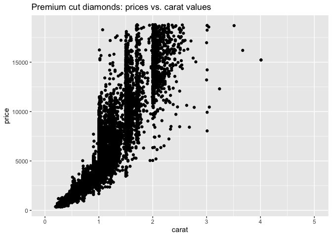<!-- -->

``` r
vgood_diamonds <- filter(diamonds, cut == "Very Good")
ggplot(vgood_diamonds) +
  geom_point(mapping = aes(x = carat, y = price)) +
  labs(title = "Very Good cut diamonds: prices vs. carat values") +
  xlim(0,5.01)
```

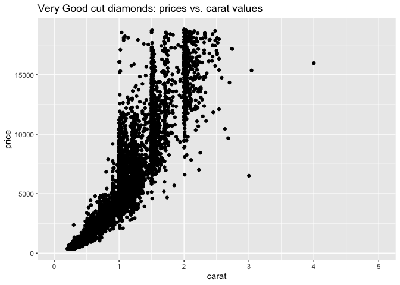<!-- -->

``` r
good_diamonds <- filter(diamonds, cut == "Good")
ggplot(good_diamonds) +
  geom_point(mapping = aes(x = carat, y = price)) +
  labs(title = "Good cut diamonds: prices vs. carat values") +
  xlim(0,5.01)
```

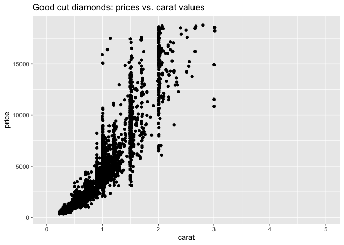<!-- -->

``` r
fair_diamonds <- filter(diamonds, cut == "Fair")
ggplot(fair_diamonds) +
  geom_point(mapping = aes(x = carat, y = price)) +
  labs(title = "Fair cut diamonds: prices vs. carat values") +
  xlim(0,5.01)
```

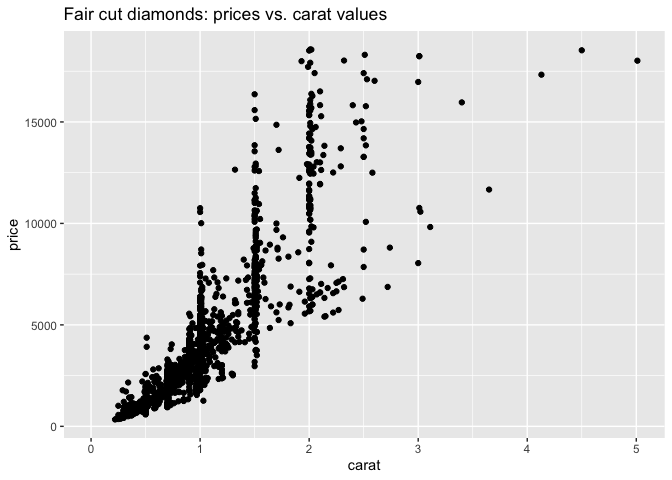<!-- -->

**Observations**:

  - These plots do end up looking quite different. This surprises me a
    little bit.

# Communication

<!-- -------------------------------------------------- -->

In this next stage, you will render your data exploration, push it to
GitHub to share with others, and link your observations within our [Data
Science
Wiki](https://olin-data-science.fandom.com/wiki/Olin_Data_Science_Wiki).

**q3** *Knit* your document in order to create a report.

You can do this by clicking the “Knit” button at the top of your
document in RStudio.


This will create a local `.md` file, and RStudio will automatically open
a preview window so you can view your knitted document.

**q4** *Push* your knitted document to GitHub.


You will need to stage both the `.md` file, as well as the `_files`
folder. Note that the `_files` folder, when staged, will expand to
include all the files under that directory.


**q5** *Document* your findings in our
[Wiki](https://olin-data-science.fandom.com/wiki/Olin_Data_Science_Wiki).
Work with your learning team to come to consensus on your findings.

The [Datasets](https://olin-data-science.fandom.com/wiki/Datasets) page
contains lists all the datasets we’ve analyzed together.

**q6** *Prepare* to present your team’s findings\!

**q7** Add a link to your personal data-science repository on the
[Repositories](https://olin-data-science.fandom.com/wiki/Repositories)
page. Make sure to file it under your team name\!
