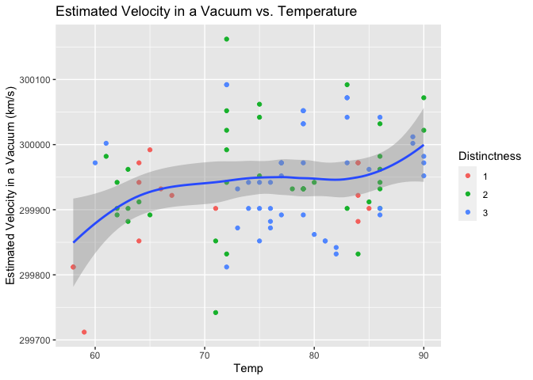

Michelson Speed-of-light Measurements
================
Angela Sharer
2020-07-18

  - [Bibliography](#bibliography)
  - [Grading Rubric](#grading-rubric)
      - [Individual](#individual)
      - [Team](#team)
      - [Due Date](#due-date)

*Purpose*: When studying physical problems, there is an important
distinction between *error* and *uncertainty*. The primary purpose of
this challenge is to dip our toes into these factors by analyzing a real
dataset.

*Reading*: [Experimental Determination of the Velocity of
Light](https://play.google.com/books/reader?id=343nAAAAMAAJ&hl=en&pg=GBS.PA115)
(Optional)

``` r
# Libraries
library(tidyverse)
library(googlesheets4)

url <- "https://docs.google.com/spreadsheets/d/1av_SXn4j0-4Rk0mQFik3LLr-uf0YdA06i3ugE6n-Zdo/edit?usp=sharing"

# Parameters
LIGHTSPEED_VACUUM    <- 299792.458 # Exact speed of light in a vacuum (km / s)
LIGHTSPEED_MICHELSON <- 299944.00  # Michelson's speed estimate (km / s)
LIGHTSPEED_PM        <- 51         # Michelson error estimate (km / s)
```

*Background*: In 1879 Albert Michelson led an experimental campaign to
measure the speed of light. His approach was a development upon the
method of Foucault, and resulted in a new estimate of
\(v_0 = 299944 \pm 51\) kilometers per second (in a vacuum). This is
very close to the modern *exact* value of `r LIGHTSPEED_VACUUM`. In this
challenge, you will analyze Michelson’s original data, and explore some
of the factors associated with his experiment.

I’ve already copied Michelson’s data from his 1880 publication; the code
chunk below will load these data from a public googlesheet.

*Aside*: The speed of light is *exact* (there is **zero error** in the
value `LIGHTSPEED_VACUUM`) because the meter is actually
[*defined*](https://en.wikipedia.org/wiki/Metre#Speed_of_light_definition)
in terms of the speed of light\!

``` r
## Note: No need to edit this chunk!
gs4_deauth()
ss <- gs4_get(url)
df_michelson <-
  read_sheet(ss) %>%
  select(Date, Distinctness, Temp, Velocity) %>%
  mutate(Distinctness = as_factor(Distinctness))
```

    ## Reading from "michelson1879"

    ## Range "Sheet1"

``` r
df_michelson %>% glimpse
```

    ## Rows: 100
    ## Columns: 4
    ## $ Date         <dttm> 1879-06-05, 1879-06-07, 1879-06-07, 1879-06-07, 1879-06…
    ## $ Distinctness <fct> 3, 2, 2, 2, 2, 2, 3, 3, 3, 3, 2, 2, 2, 2, 2, 1, 3, 3, 2,…
    ## $ Temp         <dbl> 76, 72, 72, 72, 72, 72, 83, 83, 83, 83, 83, 90, 90, 71, …
    ## $ Velocity     <dbl> 299850, 299740, 299900, 300070, 299930, 299850, 299950, …

*Data dictionary*:

  - `Date`: Date of measurement
  - `Distinctness`: Distinctness of measured images: 3 = good, 2 = fair,
    1 = poor
  - `Temp`: Ambient temperature (Fahrenheit)
  - `Velocity`: Measured speed of light (km / s)

**q1** Re-create the following table (from Michelson (1880), pg. 139)
using `df_michelson` and `dplyr`. Note that your values *will not* match
those of Michelson *exactly*; why might this be?

| Distinctness | n  | MeanVelocity |
| ------------ | -- | ------------ |
| 3            | 46 | 299860       |
| 2            | 39 | 299860       |
| 1            | 15 | 299810       |

``` r
## TODO: Compute summaries
df_q1 <- 
  df_michelson %>%
  group_by(Distinctness) %>%
  summarize(n = n(), MeanVelocity = mean(Velocity))
```

    ## `summarise()` ungrouping output (override with `.groups` argument)

``` r
df_q1 %>%
  arrange(desc(Distinctness)) %>%
  knitr::kable()
```

| Distinctness |  n | MeanVelocity |
| :----------- | -: | -----------: |
| 3            | 46 |     299861.7 |
| 2            | 39 |     299858.5 |
| 1            | 15 |     299808.0 |

**Observations**: - With increasing distinctness (from 1, which is poor,
to 3, which is good), the mean velocity increases. - This increase is
greater from 1 to 2 than from 2 to 3. - But actually, all of the mean
velocities represented here are higher than the true speed of light in a
vacuum. - This table might differ from Michelson’s due to approximations
being made during the process of computing the mean in R; I remember a
demonstrative example involving the square root of 2 being subtracted
from itself or similar, and a resulting small error. (Or perhaps
Michelson made other adjustments?)

The `Velocity` values in the dataset are the speed of light *in air*;
Michelson introduced a couple of adjustments to estimate the speed of
light in a vacuum. In total, he added \(+92\) km/s to his mean estimate
for `VelocityVacuum` (from Michelson (1880), pg. 141). While this isn’t
fully rigorous (\(+92\) km/s is based on the mean temperature), we’ll
simply apply this correction to all the observations in the dataset.

**q2** Create a new variable `VelocityVacuum` with the \(+92\) km/s
adjustment to `Velocity`. Assign this new dataframe to `df_q2`.

``` r
## TODO: Adjust the data, assign to df_q2
df_q2 <- 
  df_michelson %>%
  mutate(VelocityVacuum = Velocity + 92)

df_q2
```

    ## # A tibble: 100 x 5
    ##    Date                Distinctness  Temp Velocity VelocityVacuum
    ##    <dttm>              <fct>        <dbl>    <dbl>          <dbl>
    ##  1 1879-06-05 00:00:00 3               76   299850         299942
    ##  2 1879-06-07 00:00:00 2               72   299740         299832
    ##  3 1879-06-07 00:00:00 2               72   299900         299992
    ##  4 1879-06-07 00:00:00 2               72   300070         300162
    ##  5 1879-06-07 00:00:00 2               72   299930         300022
    ##  6 1879-06-07 00:00:00 2               72   299850         299942
    ##  7 1879-06-09 00:00:00 3               83   299950         300042
    ##  8 1879-06-09 00:00:00 3               83   299980         300072
    ##  9 1879-06-09 00:00:00 3               83   299980         300072
    ## 10 1879-06-09 00:00:00 3               83   299880         299972
    ## # … with 90 more rows

As part of his study, Michelson assessed the various potential sources
of error, and provided his best-guess for the error in his
speed-of-light estimate. These values are provided in
`LIGHTSPEED_MICHELSON`—his nominal estimate—and
`LIGHTSPEED_PM`—plus/minus bounds on his estimate. Put differently,
Michelson believed the true value of the speed-of-light probably lay
between `LIGHTSPEED_MICHELSON - LIGHTSPEED_PM` and `LIGHTSPEED_MICHELSON
+ LIGHTSPEED_PM`.

Let’s introduce some terminology:\[2\]

  - **Error** is the difference between a true value and an estimate of
    that value; for instance `LIGHTSPEED_VACUUM - LIGHTSPEED_MICHELSON`.
  - **Uncertainty** is an analyst’s *assessment* of the error.

Since a “true” value is often not known in practice, one generally does
not know the error. The best they can do is quantify their degree of
uncertainty. We will learn some means of quantifying uncertainty in this
class, but for many real problems uncertainty includes some amount of
human judgment.\[2\]

**q3** Compare Michelson’s speed of light estimate against the modern
speed of light value. Is Michelson’s estimate of the error (his
uncertainty) greater or less than the true error?

``` r
## TODO: Compare Michelson's estimate and error against the true value
Michelson_Error <- abs(LIGHTSPEED_VACUUM - LIGHTSPEED_MICHELSON)
Michelson_Error
```

    ## [1] 151.542

``` r
Error_v_Uncertainty <- Michelson_Error / LIGHTSPEED_PM
Error_v_Uncertainty
```

    ## [1] 2.971412

**Observations**:

  - The error between Michelson’s estimate and the true value is 151.542
    km/s; Michelson’s estimate was on the high side.
  - Michelson estimated his uncertainty to be \(\pm 51\) km/s; the
    actual error was almost 3 times this value.

**q4** You have access to a few other variables. Construct a few
visualizations of `VelocityVacuum` against these other factors. Are
there other patterns in the data that might help explain the difference
between Michelson’s estimate and `LIGHTSPEED_VACUUM`?

``` r
df_q2 %>%
  ggplot() +
    geom_point(
      mapping = aes(x = Temp, y = VelocityVacuum, color = Distinctness)
    ) +
    geom_smooth(mapping = aes(x = Temp, y = VelocityVacuum)) +
    labs(
      title = "Estimated Velocity in a Vacuum vs. Temperature", 
      y = "Estimated Velocity in a Vacuum (km/s)"
    )
```

    ## `geom_smooth()` using method = 'loess' and formula 'y ~ x'

<!-- -->

**Observations**:

  - There seems to be a relationship between temperature and observed
    velocity; higher temperatures lead to higher observed velocities.

<!-- end list -->

``` r
df_lowtemps <-
  filter(df_q2, Temp < 60) %>%
  arrange(Velocity)

df_lowtemps
```

    ## # A tibble: 3 x 5
    ##   Date                Distinctness  Temp Velocity VelocityVacuum
    ##   <dttm>              <fct>        <dbl>    <dbl>          <dbl>
    ## 1 1879-06-18 00:00:00 1               59   299620         299712
    ## 2 1879-06-18 00:00:00 1               58   299720         299812
    ## 3 1879-06-18 00:00:00 1               58   299720         299812

``` r
df_hightemps <-
  filter(df_q2, Temp >= 90) %>%
  arrange(Velocity)

df_hightemps
```

    ## # A tibble: 5 x 5
    ##   Date                Distinctness  Temp Velocity VelocityVacuum
    ##   <dttm>              <fct>        <dbl>    <dbl>          <dbl>
    ## 1 1879-06-23 00:00:00 3               90   299860         299952
    ## 2 1879-06-23 00:00:00 3               90   299880         299972
    ## 3 1879-06-23 00:00:00 3               90   299890         299982
    ## 4 1879-06-10 00:00:00 2               90   299930         300022
    ## 5 1879-06-10 00:00:00 2               90   299980         300072

**Observations**:

  - At the lowest temperatures (less than 60 degrees Fahrenheit), we
    observe some of the lowest velocities in the dataset, with estimates
    for the velocity in a vacuum ranging from 299,712 to 299,812 km/s.
    (The true speed of light in a vacuum falls in this range.)
  - At the highest temperatures (90 degrees Fahrenheit), all velocities
    measured are higher than this range, with velocities in a vacuum
    ranging from 299,952 to 300,072 km/s.
  - Therefore, there may be a relationship (and indeed the physics of
    light moving through a medium, and the effects of temperature on the
    properties of our atmosphere would confirm this) between temperature
    and the speed of light. This dataset is limited (only 100
    observations), so it is difficult to measure from this alone, but it
    certainly would have been interesting to see the experiment run
    during the winter, rather than June and July, and observe the
    results during colder temperatures.

<!-- end list -->

``` r
df_q2 %>%
  ggplot() +
    geom_boxplot(mapping = aes(x = Distinctness, y = VelocityVacuum)) +
    labs(
      title = "Estimated Velocity in a Vacuum by Distinctness", 
      y = "Estimated Velocity in a Vacuum (km/s)"
    )
```

<!-- -->

**Observations**:

  - As observed in the tables, increasing distinctness also yields to an
    increase in mean velocity.
  - Only the poor and fair distinctness observations yield estimates for
    the velocity in a vacuum that cover the range including the true
    velocity.

<!-- end list -->

``` r
df_q2 %>%
  ggplot() +
    geom_point(mapping = aes(x = Date, y = VelocityVacuum, color = Distinctness)) +
    geom_smooth(mapping = aes(x = Date, y = VelocityVacuum)) +
    labs(
      title = "Estimated Velocity in a Vacuum by Date and Distinctness", 
      y = "Estimated Velocity in a Vacuum (km/s)"
    )
```

    ## `geom_smooth()` using method = 'loess' and formula 'y ~ x'

<!-- -->

**Observations**:

  - All poor distinctness observations took place in the first half of
    the experiment, June 12 - June 18.
  - Earlier measurements skewed a bit higher than later measurements.

<!-- end list -->

``` r
df_q2 %>%
  ggplot() +
    geom_point(mapping = aes(x = Date, y = Temp)) +
    geom_smooth(mapping = aes(x = Date, y = Temp)) +
    labs(title = "Date and Temperature", y = "Temperature (degrees Fahrenheit)")
```

    ## `geom_smooth()` using method = 'loess' and formula 'y ~ x'

<!-- -->

**Observations**:

  - Temperatures (as measured during data collection only) were lowest
    at the beginning of the experiment, and again for a few days during
    the middle of the experiment.

## Bibliography

  - \[1\] Michelson, [Experimental Determination of the Velocity of
    Light](https://play.google.com/books/reader?id=343nAAAAMAAJ&hl=en&pg=GBS.PA115)
    (1880)
  - \[2\] Henrion and Fischhoff, [Assessing Uncertainty in Physical
    Constants](https://www.cmu.edu/epp/people/faculty/research/Fischoff-Henrion-Assessing%20uncertainty%20in%20physical%20constants.pdf)
    (1986)

<!-- include-rubric -->

# Grading Rubric

<!-- -------------------------------------------------- -->

Unlike exercises, **challenges will be graded**. The following rubrics
define how you will be graded, both on an individual and team basis.

## Individual

<!-- ------------------------- -->

| Category    | Unsatisfactory                                                                   | Satisfactory                                                               |
| ----------- | -------------------------------------------------------------------------------- | -------------------------------------------------------------------------- |
| Effort      | Some task **q**’s left unattempted                                               | All task **q**’s attempted                                                 |
| Observed    | Did not document observations                                                    | Documented observations based on analysis                                  |
| Supported   | Some observations not supported by analysis                                      | All observations supported by analysis (table, graph, etc.)                |
| Code Styled | Violations of the [style guide](https://style.tidyverse.org/) hinder readability | Code sufficiently close to the [style guide](https://style.tidyverse.org/) |

## Team

<!-- ------------------------- -->

| Category   | Unsatisfactory                                                                                   | Satisfactory                                       |
| ---------- | ------------------------------------------------------------------------------------------------ | -------------------------------------------------- |
| Documented | No team contributions to Wiki                                                                    | Team contributed to Wiki                           |
| Referenced | No team references in Wiki                                                                       | At least one reference in Wiki to member report(s) |
| Relevant   | References unrelated to assertion, or difficult to find related analysis based on reference text | Reference text clearly points to relevant analysis |

## Due Date

<!-- ------------------------- -->

All the deliverables stated in the rubrics above are due on the day of
the class discussion of that exercise. See the
[Syllabus](https://docs.google.com/document/d/1jJTh2DH8nVJd2eyMMoyNGroReo0BKcJrz1eONi3rPSc/edit?usp=sharing)
for more information.
