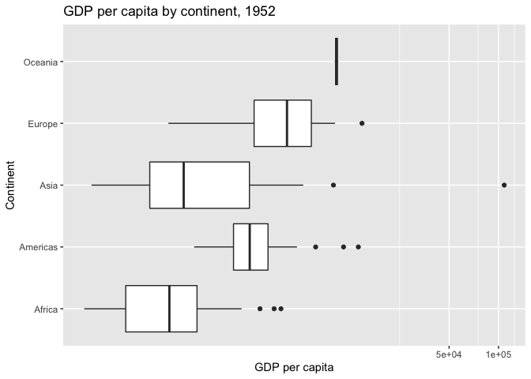
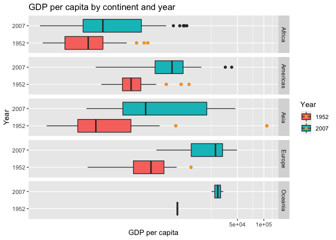
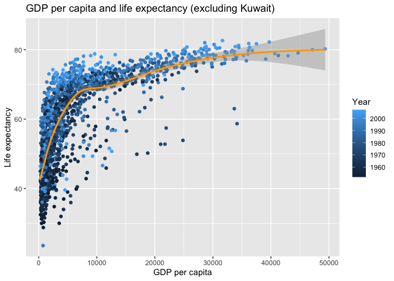

Gapminder
================
Angela Sharer
2020-07-24

  - [Guided EDA](#guided-eda)
  - [Your Own EDA](#your-own-eda)
  - [Grading Rubric](#grading-rubric)
      - [Individual](#individual)
      - [Team](#team)
      - [Due Date](#due-date)

*Purpose*: Learning to do EDA well takes practice\! In this challenge
you’ll further practice EDA by first completing a guided exploration,
then by conducting your own investigation. This challenge will also give
you a chance to use the wide variety of visual tools we’ve been
learning.

``` r
library(tidyverse)
```

    ## ── Attaching packages ──────────────────────────────────────────────────────────────────────── tidyverse 1.3.0 ──

    ## ✓ ggplot2 3.3.2     ✓ purrr   0.3.4
    ## ✓ tibble  3.0.1     ✓ dplyr   1.0.0
    ## ✓ tidyr   1.1.0     ✓ stringr 1.4.0
    ## ✓ readr   1.3.1     ✓ forcats 0.5.0

    ## ── Conflicts ─────────────────────────────────────────────────────────────────────────── tidyverse_conflicts() ──
    ## x dplyr::filter() masks stats::filter()
    ## x dplyr::lag()    masks stats::lag()

``` r
library(gapminder)
```

*Background*: [Gapminder](https://www.gapminder.org/about-gapminder/) is
an independent organization that seeks to education people about the
state of the world. They promote a “fact-based worldview” by focusing on
data. The dataset we’ll study in this challenge is from Gapminder.

# Guided EDA

<!-- -------------------------------------------------- -->

First, we’ll go through a round of *guided EDA*. Try to pay attention to
the high-level process we’re going through—after this guided round
you’ll be responsible for doing another cycle of EDA on your own\!

**q0** Perform your “first checks” on the dataset. What variables are in
this dataset?

``` r
## TASK: Do your "first checks" here!
glimpse(gapminder)
```

    ## Rows: 1,704
    ## Columns: 6
    ## $ country   <fct> Afghanistan, Afghanistan, Afghanistan, Afghanistan, Afghani…
    ## $ continent <fct> Asia, Asia, Asia, Asia, Asia, Asia, Asia, Asia, Asia, Asia,…
    ## $ year      <int> 1952, 1957, 1962, 1967, 1972, 1977, 1982, 1987, 1992, 1997,…
    ## $ lifeExp   <dbl> 28.801, 30.332, 31.997, 34.020, 36.088, 38.438, 39.854, 40.…
    ## $ pop       <int> 8425333, 9240934, 10267083, 11537966, 13079460, 14880372, 1…
    ## $ gdpPercap <dbl> 779.4453, 820.8530, 853.1007, 836.1971, 739.9811, 786.1134,…

**Observations**:

  - `country`: Country (factor)
  - `continent`: Continent (factor)
  - `year`: Year (integer; 4 digits)
  - `lifeExp`: Life Expectancy in years (double)
  - `pop`: Population (int)
  - `gdpPercap`: Gross Domestic Product per Capita

**q1** Determine the most and least recent years in the `gapminder`
dataset.

``` r
## TASK: Find the largest and smallest values of `year` in `gapminder`

year_max <- max(select(gapminder, year))
year_min <- min(select(gapminder, year))
```

Use the following test to check your work.

``` r
## NOTE: No need to change this
assertthat::assert_that(year_max %% 7 == 5)
```

    ## [1] TRUE

``` r
assertthat::assert_that(year_max %% 3 == 0)
```

    ## [1] TRUE

``` r
assertthat::assert_that(year_min %% 7 == 6)
```

    ## [1] TRUE

``` r
assertthat::assert_that(year_min %% 3 == 2)
```

    ## [1] TRUE

``` r
print("Nice!")
```

    ## [1] "Nice!"

**q2** Filter on years matching `year_min`, and make a plot of the GDE
per capita against continent. Choose an appropriate `geom_` to visualize
the data. What observations can you make?

You may encounter difficulties in visualizing these data; if so document
your challenges and attempt to produce the most informative visual you
can.

``` r
## TASK: Create a visual of gdpPercap vs continent
gapminder %>%
  filter(year == year_min) %>%
  ggplot(aes(gdpPercap, continent)) +
    geom_boxplot() +
    coord_trans(x = "log") +
    labs(title = "GDP per capita by continent", x = "GDP per capita", y = "Continent")
```

<!-- -->

**Observations**:

  - In 1952, Oceania had the highest mean GPD per capita, followed by
    Europe, the Americas, Asia, and lastly Africa.
  - Asia has the greatest spread of GDP per capita of any continent,
    having one country with a GDP that is much higher than any other
    country this year.

**Difficulties & Approaches**:

  - Difficult to differentiate between GDP values near zero, where many
    are clustered. Used a boxplot for a high-level summary and flipped
    the axes to get greater resolution in GDP.  
  - This still wasn’t enough. Scaled the x-axis to be logarithmic.

**q3** You should have found at least three outliers in q2. Identify
those outliers (figure out which countries they are).

``` r
## TASK: Identify the outliers from q2
outliers_1952 <-
  gapminder %>%
  filter(year == year_min) %>%
  group_by(continent) %>%
  mutate(
    "lowerbound" = quantile(gdpPercap, 0.25) - IQR(gdpPercap)*1.5, 
    "upperbound" = quantile(gdpPercap, 0.75) + IQR(gdpPercap)*1.5
  ) %>%
  filter(gdpPercap < lowerbound | gdpPercap > upperbound)

outliers_1952
```

    ## # A tibble: 9 x 8
    ## # Groups:   continent [4]
    ##   country       continent  year lifeExp      pop gdpPercap lowerbound upperbound
    ##   <fct>         <fct>     <int>   <dbl>    <int>     <dbl>      <dbl>      <dbl>
    ## 1 Angola        Africa     1952    30.0   4.23e6     3521.      -845.      2835.
    ## 2 Bahrain       Asia       1952    50.9   1.20e5     9867.     -2679.      6464.
    ## 3 Canada        Americas   1952    68.8   1.48e7    11367.       161.      6208.
    ## 4 Gabon         Africa     1952    37.0   4.21e5     4293.      -845.      2835.
    ## 5 Kuwait        Asia       1952    55.6   1.60e5   108382.     -2679.      6464.
    ## 6 South Africa  Africa     1952    45.0   1.43e7     4725.      -845.      2835.
    ## 7 Switzerland   Europe     1952    69.6   4.82e6    14734.     -2752.     13230.
    ## 8 United States Americas   1952    68.4   1.58e8    13990.       161.      6208.
    ## 9 Venezuela     Americas   1952    55.1   5.44e6     7690.       161.      6208.

**Observations**:

  - Identify the outlier countries from q2: Angola, Bahrain, Canada,
    Gabon, Kuwait, South Africa, Switzerland, United States, and
    Venezuela

**q4** Create a plot similar to yours from q2 studying both `year_min`
and `year_max`. Find a way to highlight the outliers from q3 on your
plot. Compare the patterns between `year_min` and `year_max`.

*Hint*: We’ve learned a lot of different ways to show multiple
variables; think about using different aesthetics or facets.

``` r
## TASK: Create a visual of gdpPercap vs continent

gapminder %>%
  filter(year == year_min | year == year_max) %>%
  ggplot(aes(gdpPercap, as.factor(year), fill = as.factor(year))) +
    geom_boxplot() +
    geom_point(data = outliers_1952, color = "orange") +
    coord_trans(x = "log") +    
    facet_grid(continent ~ .) +
    labs(
      title = "GDP per capita by continent and year", 
      x = "GDP per capita", 
      y = "Year")
```

<!-- -->

**Observations**:

  - Mean GDP per capita increased for all continents from 1952 to 2007.
  - In all cases except Asia, the boxplot’s whiskers in 2007 extend
    higher than the GDP for the highest outlier in that continent in
    1952.

# Your Own EDA

<!-- -------------------------------------------------- -->

Now it’s your turn\! We just went through guided EDA considering the GDP
per capita at two time points. You can continue looking at outliers,
consider different years, repeat the exercise with `lifeExp`, consider
the relationship between variables, or something else entirely.

**q5** Create *at least* three new figures below. With each figure, try
to pose new questions about the data.

How do GDP and life expectancy compare?

``` r
## TASK: Your first graph
ggplot(gapminder, aes(gdpPercap, lifeExp)) +
  geom_point(aes(color = year)) +
  coord_trans(x = "log") +
  geom_smooth(color = "orange") +
  labs(
    title = "GDP per capita and life expectancy",
    x = "GDP per capita",
    y = "Life expectancy"
  )
```

    ## `geom_smooth()` using method = 'gam' and formula 'y ~ s(x, bs = "cs")'

<!-- -->

**Observations**

  - As we might expect, increasing GDP per capita tends to mean an
    increased life expectancy, except at the very top values of GDP per
    capita.
  - I would hypothesize that these countries were likely oil-rich
    authoritarian states, with a high GDP benefiting only the wealthiest
    in the country, leaving a large portion of the population poor, and
    in correspondingly poor health. Or it’s the US; this could really go
    either way.

<!-- end list -->

``` r
topGDP <-
  gapminder %>%
  filter(gdpPercap > 50000) %>%
  arrange(desc(gdpPercap))

topGDP
```

    ## # A tibble: 6 x 6
    ##   country continent  year lifeExp     pop gdpPercap
    ##   <fct>   <fct>     <int>   <dbl>   <int>     <dbl>
    ## 1 Kuwait  Asia       1957    58.0  212846   113523.
    ## 2 Kuwait  Asia       1972    67.7  841934   109348.
    ## 3 Kuwait  Asia       1952    55.6  160000   108382.
    ## 4 Kuwait  Asia       1962    60.5  358266    95458.
    ## 5 Kuwait  Asia       1967    64.6  575003    80895.
    ## 6 Kuwait  Asia       1977    69.3 1140357    59265.

**Observations** - All the GDP per capita values greater than $50,000
are Kuwait. (I’m feeling smug. All those political science classes are
paying off right now.) - At least the US didn’t turn out to be in this
set, I guess.

So… What’s the trend in the US over time with respect to GDP and life
expectancy?

``` r
## TASK: Your second graph
gapminder %>%
  filter(country == "United States") %>%
  ggplot(aes(year, gdpPercap)) +
    geom_point(aes(color = lifeExp)) +
    scale_color_continuous(name = "Life expectancy") +
    labs(
      title = "GDP per capita and life expectancy in the United States, 1952-2007",
      x = "Year",
      y = "GDP per capita"
    )
```

<!-- -->

**Observations**

  - Boring but good.
  - Now I’m curious about Kuwait though.

<!-- end list -->

``` r
## TASK: Your third graph

gapminder %>%
  filter(country == "Kuwait") %>%
  ggplot(aes(year, gdpPercap)) +
    geom_point(aes(color = lifeExp)) +
    scale_color_continuous(name = "Life expectancy") +
    labs(
      title = "GDP per capita and life expectancy in Kuwait, 1952-2007",
      x = "Year",
      y = "GDP per capita"
    )
```

<!-- -->

**Observations**

  - Fascinating. Life expectancy increases pretty steadily over the time
    period, but meanwhile GDP falls dramatically from the early 1970s to
    the mid 1980s, then starts climbing again.
  - I wonder what political changes were wrought in this time period to
    bring about this effect?

<!-- include-rubric -->

# Grading Rubric

<!-- -------------------------------------------------- -->

Unlike exercises, **challenges will be graded**. The following rubrics
define how you will be graded, both on an individual and team basis.

## Individual

<!-- ------------------------- -->

| Category    | Unsatisfactory                                                                   | Satisfactory                                                               |
| ----------- | -------------------------------------------------------------------------------- | -------------------------------------------------------------------------- |
| Effort      | Some task **q**’s left unattempted                                               | All task **q**’s attempted                                                 |
| Observed    | Did not document observations                                                    | Documented observations based on analysis                                  |
| Supported   | Some observations not supported by analysis                                      | All observations supported by analysis (table, graph, etc.)                |
| Code Styled | Violations of the [style guide](https://style.tidyverse.org/) hinder readability | Code sufficiently close to the [style guide](https://style.tidyverse.org/) |

## Team

<!-- ------------------------- -->

| Category   | Unsatisfactory                                                                                   | Satisfactory                                       |
| ---------- | ------------------------------------------------------------------------------------------------ | -------------------------------------------------- |
| Documented | No team contributions to Wiki                                                                    | Team contributed to Wiki                           |
| Referenced | No team references in Wiki                                                                       | At least one reference in Wiki to member report(s) |
| Relevant   | References unrelated to assertion, or difficult to find related analysis based on reference text | Reference text clearly points to relevant analysis |

## Due Date

<!-- ------------------------- -->

All the deliverables stated in the rubrics above are due on the day of
the class discussion of that exercise. See the
[Syllabus](https://docs.google.com/document/d/1jJTh2DH8nVJd2eyMMoyNGroReo0BKcJrz1eONi3rPSc/edit?usp=sharing)
for more information.
