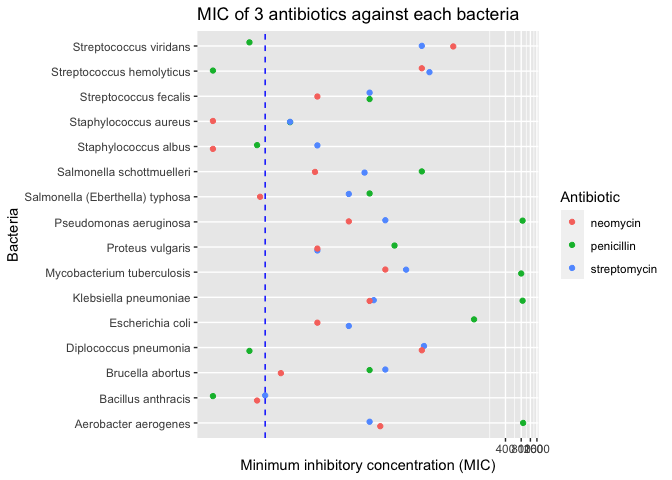

Antibiotics
================
Angela Sharer
2020-07-26

  - [Visualization](#visualization)
      - [Purpose: Compare Effectiveness](#purpose-compare-effectiveness)
      - [Purpose: Categorize Bacteria](#purpose-categorize-bacteria)
  - [References](#references)
  - [Grading Rubric](#grading-rubric)
      - [Individual](#individual)
      - [Team](#team)
      - [Due Date](#due-date)

*Purpose*: To create an effective visualization, we need to keep our
*purpose* firmly in mind. There are many different ways to visualize
data, and the only way we can judge efficacy is with respect to our
purpose.

In this challenge you’ll visualize the same data in two different ways,
aimed at two different purposes.

*Note*: Please complete your initial visual design **alone**. Work on
both of your graphs alone, and save a version to your repo *before*
coming together with your team. This way you can all bring a diversity
of ideas to the table\!

``` r
library(tidyverse)
```

    ## ── Attaching packages ───────────────────────────────────────────────────────────────────────── tidyverse 1.3.0 ──

    ## ✓ ggplot2 3.3.2     ✓ purrr   0.3.4
    ## ✓ tibble  3.0.1     ✓ dplyr   1.0.0
    ## ✓ tidyr   1.1.0     ✓ stringr 1.4.0
    ## ✓ readr   1.3.1     ✓ forcats 0.5.0

    ## ── Conflicts ──────────────────────────────────────────────────────────────────────────── tidyverse_conflicts() ──
    ## x dplyr::filter() masks stats::filter()
    ## x dplyr::lag()    masks stats::lag()

``` r
library(ggrepel)
```

*Background*: The data\[1\] we study in this challenge report the
[*minimum inhibitory
concentration*](https://en.wikipedia.org/wiki/Minimum_inhibitory_concentration)
(MIC) of three drugs for different bacteria. The smaller the MIC for a
given drug and bacteria pair, the more practical the drug is for
treating that particular bacteria. An MIC value of *at most* 0.1 is
considered necessary for treating human patients.

These data report MIC values for three antibiotics—penicillin,
streptomycin, and neomycin—on 16 bacteria. Bacteria are categorized into
a genus based on a number of features, including their resistance to
antibiotics.

``` r
## NOTE: If you extracted all challenges to the same location,
## you shouldn't have to change this filename
filename <- "./data/antibiotics.csv"

## Load the data
df_antibiotics <- read_csv(filename)
```

    ## Parsed with column specification:
    ## cols(
    ##   bacteria = col_character(),
    ##   penicillin = col_double(),
    ##   streptomycin = col_double(),
    ##   neomycin = col_double(),
    ##   gram = col_character()
    ## )

``` r
df_antibiotics %>% knitr::kable()
```

| bacteria                        | penicillin | streptomycin | neomycin | gram     |
| :------------------------------ | ---------: | -----------: | -------: | :------- |
| Aerobacter aerogenes            |    870.000 |         1.00 |    1.600 | negative |
| Brucella abortus                |      1.000 |         2.00 |    0.020 | negative |
| Bacillus anthracis              |      0.001 |         0.01 |    0.007 | positive |
| Diplococcus pneumonia           |      0.005 |        11.00 |   10.000 | positive |
| Escherichia coli                |    100.000 |         0.40 |    0.100 | negative |
| Klebsiella pneumoniae           |    850.000 |         1.20 |    1.000 | negative |
| Mycobacterium tuberculosis      |    800.000 |         5.00 |    2.000 | negative |
| Proteus vulgaris                |      3.000 |         0.10 |    0.100 | negative |
| Pseudomonas aeruginosa          |    850.000 |         2.00 |    0.400 | negative |
| Salmonella (Eberthella) typhosa |      1.000 |         0.40 |    0.008 | negative |
| Salmonella schottmuelleri       |     10.000 |         0.80 |    0.090 | negative |
| Staphylococcus albus            |      0.007 |         0.10 |    0.001 | positive |
| Staphylococcus aureus           |      0.030 |         0.03 |    0.001 | positive |
| Streptococcus fecalis           |      1.000 |         1.00 |    0.100 | positive |
| Streptococcus hemolyticus       |      0.001 |        14.00 |   10.000 | positive |
| Streptococcus viridans          |      0.005 |        10.00 |   40.000 | positive |

**What’s the deal with this “gram” column?**

According to Wikipedia, “Gram staining differentiates bacteria by the
chemical and physical properties of their cell walls. Gram-positive
cells have a thick layer of peptidoglycan in the cell wall…
Gram-negative cells have a thinner peptidoglycan layer.” This can make
them respond differently to e.g. antibiotics.
<https://en.wikipedia.org/wiki/Gram_stain>

# Visualization

<!-- -------------------------------------------------- -->

## Purpose: Compare Effectiveness

<!-- ------------------------- -->

``` r
df_antibiotics2 <-
  df_antibiotics %>%
  group_by(bacteria) %>%
  mutate(min_MIC = min(penicillin, streptomycin, neomycin)) %>%
  ungroup() %>%
  pivot_longer(
    names_to = "drug",
    values_to = "MIC",
    cols = c(penicillin, streptomycin, neomycin)
  ) %>%
  mutate(
    effective = MIC <= 0.1
    ) %>%
  separate(
    col = bacteria, 
    into = c("genus","species1", "species2"), 
    sep = " ",
    remove = FALSE
    ) %>%
  unite(col = species, species1, species2, sep = " ", na.rm = TRUE)
```

    ## Warning: Expected 3 pieces. Missing pieces filled with `NA` in 45 rows [1, 2, 3,
    ## 4, 5, 6, 7, 8, 9, 10, 11, 12, 13, 14, 15, 16, 17, 18, 19, 20, ...].

``` r
df_antibiotics2 
```

    ## # A tibble: 48 x 8
    ##    bacteria         genus     species  gram   min_MIC drug         MIC effective
    ##    <chr>            <chr>     <chr>    <chr>    <dbl> <chr>      <dbl> <lgl>    
    ##  1 Aerobacter aero… Aerobact… aerogen… negat…   1     penicil… 870     FALSE    
    ##  2 Aerobacter aero… Aerobact… aerogen… negat…   1     strepto…   1     FALSE    
    ##  3 Aerobacter aero… Aerobact… aerogen… negat…   1     neomycin   1.6   FALSE    
    ##  4 Brucella abortus Brucella  abortus  negat…   0.02  penicil…   1     FALSE    
    ##  5 Brucella abortus Brucella  abortus  negat…   0.02  strepto…   2     FALSE    
    ##  6 Brucella abortus Brucella  abortus  negat…   0.02  neomycin   0.02  TRUE     
    ##  7 Bacillus anthra… Bacillus  anthrac… posit…   0.001 penicil…   0.001 TRUE     
    ##  8 Bacillus anthra… Bacillus  anthrac… posit…   0.001 strepto…   0.01  TRUE     
    ##  9 Bacillus anthra… Bacillus  anthrac… posit…   0.001 neomycin   0.007 TRUE     
    ## 10 Diplococcus pne… Diplococ… pneumon… posit…   0.005 penicil…   0.005 TRUE     
    ## # … with 38 more rows

**q1** Create a visualization of `df_antibiotics` that helps you to
compare the effectiveness of the three antibiotics across all the
bacteria reported. Can you make any broad statements about antibiotic
effectiveness?

``` r
## TASK: Create your visualization
df_antibiotics2 %>%
  ggplot(aes(drug, MIC)) +
  geom_boxplot() +
  coord_trans(y = "log") +
  labs(
    title = "MIC of 3 antibiotics against various bacteria",
    x = "Antibiotic",
    y = "Minimum inhibitory concentration (MIC)"
  )
```

<!-- -->

``` r
## NOTE: I'd like to rearrange the ordering of drugs here but I need to double check how I can do that... I know there is a way!

df_antibiotics2 %>%
  ggplot(aes(MIC, drug)) +
  geom_col(aes(fill = effective)) +
  scale_fill_discrete(name = "Effective for humans?") +
  coord_cartesian(xlim = c(0, 0.1)) +
  facet_wrap(~ bacteria) +
  labs(
    title = "MIC of 3 antibiotics against each bacteria",
    x = "Minimum inhibitory concentration (MIC)",
    y = "Antibiotic"
  )
```

<!-- -->

``` r
## I've got a ton of clipping and overlapping text happening here. Not sure how to fix.

df_antibiotics2 %>%
  ggplot(aes(MIC, bacteria, color = drug)) +
  geom_jitter(width = 0, height = 0.15) +
  coord_trans(x = "log") + 
  scale_color_discrete(name = "Antibiotic") +
  geom_vline(xintercept = 0.01, linetype = "dashed", color = "blue") +
  labs(
    title = "MIC of 3 antibiotics against each bacteria",
    x = "Minimum inhibitory concentration (MIC)",
    y = "Bacteria"
  ) 
```

<!-- -->

**Observations**:

  - Each of these antibiotics varies substantially in its effectiveness,
    depending on the bacteria in question.
  - The effectiveness of penicillin varies more than the other two
    antibiotics.
  - The antibiotics investigated here cannot effectively combat all of
    these bacteria in humans. In fact, these antibiotics are only
    effective against 12 of the 16 bacteria here.
  - Neomycin seems to be more effective on average than either of the
    other drugs (that is, it has the lowest average MIC value against
    the bacteria in this dataset).
  - Streptomycin is only effective against one of these bacteria
    (bacillus anthracis), but the other two antibiotics are even more
    effective against that bacteria.
  - Can you make any broad statements about antibiotic effectiveness?

## Purpose: Categorize Bacteria

<!-- ------------------------- -->

The *genus* of a living organism is a human categorization, based on
various characteristics of the organism. Since these categories are
based on numerous factors, we will tend to see clusters if we visualize
data according to relevant variables. We can use these visuals to
categorize observations, and to question whether given categories are
reasonable\!

**q2** Create a visualization of `df_antibiotics` that helps you to
categorize bacteria according to the variables in the data. Document
your observations on how how clusters of bacteria in the variables do—or
don’t—align with their *genus* classification.

``` r
## TASK: Create your visualization
df_antibiotics2 %>%
  ggplot(aes(MIC, genus, color = drug)) +
  geom_jitter(width = 0, height = 0.15) +
  coord_trans(x = "log") + 
  scale_color_discrete(name = "Antibiotic") +
  geom_vline(xintercept = 0.01, linetype = "dashed", color = "blue") +
  labs(
    title = "MIC of 3 antibiotics against each genus of bacteria",
    x = "Minimum inhibitory concentration (MIC)",
    y = "Genus of bacteria"
  ) 
```

<!-- -->

``` r
df_antibiotics2 %>%
  ggplot(aes(drug, MIC)) +
  geom_jitter(aes(color = genus), height = 0, width = 0.15) +
  coord_trans(y = "log") +
  geom_hline(yintercept = 0.01, linetype = "dashed", color = "blue") +
  labs(
    title = "MIC of 3 antibiotics against various bacteria",
    x = "Antibiotic",
    y = "Minimum inhibitory concentration (MIC)"
  )
```

<!-- -->

``` r
## NOTE: I'd like to rearrange the ordering of drugs here but I need to double check how I can do that... I know there is a way!

df_antibiotics2 %>%
  ggplot(aes(drug, MIC)) +
  geom_jitter(aes(color = gram), height = 0, width = 0.15) +
  coord_trans(y = "log") +
  geom_hline(yintercept = 0.01, linetype = "dashed", color = "blue") +
  labs(
    title = "MIC of 3 antibiotics against various bacteria",
    x = "Antibiotic",
    y = "Minimum inhibitory concentration (MIC)"
  )
```

<!-- -->

``` r
df_antibiotics2 %>%
  ggplot(aes(drug, MIC)) +
  geom_boxplot() +
  coord_trans(y = "log") +
  geom_hline(yintercept = 0.01, linetype = "dashed", color = "blue") +
  facet_grid(. ~ gram) +
  labs(
    title = "MIC of 3 antibiotics against various bacteria",
    x = "Antibiotic",
    y = "Minimum inhibitory concentration (MIC)"
  )
```

<!-- -->

**Observations**:

  - The gram type (positive or negative) matters: Penicillin is much
    more effective against gram-positive bacteria, and neomycin and
    streptomycin have potential to be so as well (though their
    effectiveness against the gram-positive bacteria in this dataset
    varies more than pencillin’s does).
  - These antibiotics work better on gram-positive bacteria, it seems;
    and only neomycin is effective for use in humans against a
    (particular) gram-negative bacteria.

# References

<!-- -------------------------------------------------- -->

\[1\] Neomycin in skin infections: A new topical antibiotic with wide
antibacterial range and rarely sensitizing. Scope. 1951;3(5):4-7.

\[2\] Wainer and Lysen, “That’s Funny…” /American Scientist/ (2009)
[link](https://www.americanscientist.org/article/thats-funny)

<!-- include-rubric -->

# Grading Rubric

<!-- -------------------------------------------------- -->

Unlike exercises, **challenges will be graded**. The following rubrics
define how you will be graded, both on an individual and team basis.

## Individual

<!-- ------------------------- -->

| Category    | Unsatisfactory                                                                   | Satisfactory                                                               |
| ----------- | -------------------------------------------------------------------------------- | -------------------------------------------------------------------------- |
| Effort      | Some task **q**’s left unattempted                                               | All task **q**’s attempted                                                 |
| Observed    | Did not document observations                                                    | Documented observations based on analysis                                  |
| Supported   | Some observations not supported by analysis                                      | All observations supported by analysis (table, graph, etc.)                |
| Code Styled | Violations of the [style guide](https://style.tidyverse.org/) hinder readability | Code sufficiently close to the [style guide](https://style.tidyverse.org/) |

## Team

<!-- ------------------------- -->

| Category   | Unsatisfactory                                                                                   | Satisfactory                                       |
| ---------- | ------------------------------------------------------------------------------------------------ | -------------------------------------------------- |
| Documented | No team contributions to Wiki                                                                    | Team contributed to Wiki                           |
| Referenced | No team references in Wiki                                                                       | At least one reference in Wiki to member report(s) |
| Relevant   | References unrelated to assertion, or difficult to find related analysis based on reference text | Reference text clearly points to relevant analysis |

## Due Date

<!-- ------------------------- -->

All the deliverables stated in the rubrics above are due on the day of
the class discussion of that exercise. See the
[Syllabus](https://docs.google.com/document/d/1jJTh2DH8nVJd2eyMMoyNGroReo0BKcJrz1eONi3rPSc/edit?usp=sharing)
for more information.
