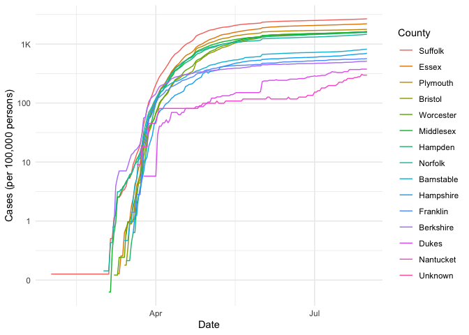

COVID-19
================
Angela Sharer
2020-07-31

  - [The Big Picture](#the-big-picture)
  - [Get the Data](#get-the-data)
      - [Navigating the Census Bureau](#navigating-the-census-bureau)
      - [Automated Download of NYT
        Data](#automated-download-of-nyt-data)
  - [Join the Data](#join-the-data)
  - [Analyze](#analyze)
      - [Normalize](#normalize)
      - [Guided EDA](#guided-eda)
      - [Self-directed EDA](#self-directed-eda)
          - [Comparing to New York City](#comparing-to-new-york-city)
          - [Investigating counties where my family members
            live](#investigating-counties-where-my-family-members-live)
          - [Investigating counties where Team Zeta members
            live](#investigating-counties-where-team-zeta-members-live)
          - [Team Zeta’s Tales of Two
            Counties](#team-zetas-tales-of-two-counties)
  - [Notes](#notes)
  - [Appendix](#appendix)
      - [Grading Rubric](#grading-rubric)
          - [Individual](#individual)
          - [Team](#team)
          - [Due Date](#due-date)
      - [Suggestions and tips from
        Zach](#suggestions-and-tips-from-zach)
          - [Ideas](#ideas)
          - [Aside: Some visualization
            tricks](#aside-some-visualization-tricks)
          - [Geographic exceptions](#geographic-exceptions)
          - [Code snippet from Zach, modified by
            Angela](#code-snippet-from-zach-modified-by-angela)

*Purpose*: We can’t *possibly* do a class on data science and *not* look
at covid-19. Come on.

In this challenge, you’ll learn how to navigate the U.S. Census Bureau
website, programmatically download data from the internet, and perform a
county-level population-weighted analysis of current covid-19 trends.
Get excited\!

``` r
library(tidyverse)
```

    ## ── Attaching packages ─────────────────────────────────────────────────────────────────────────── tidyverse 1.3.0 ──

    ## ✓ ggplot2 3.3.2     ✓ purrr   0.3.4
    ## ✓ tibble  3.0.1     ✓ dplyr   1.0.0
    ## ✓ tidyr   1.1.0     ✓ stringr 1.4.0
    ## ✓ readr   1.3.1     ✓ forcats 0.5.0

    ## ── Conflicts ────────────────────────────────────────────────────────────────────────────── tidyverse_conflicts() ──
    ## x dplyr::filter() masks stats::filter()
    ## x dplyr::lag()    masks stats::lag()

*Background*:
[COVID-19](https://en.wikipedia.org/wiki/Coronavirus_disease_2019) is
the disease caused by the virus SARS-CoV-2. In 2020 it became a global
pandemic, leading to huge loss of life and tremendous disruption to
society. The New York Times published up-to-date data on the progression
of the pandemic across the United States—we will study these data in
this challenge.

# The Big Picture

<!-- -------------------------------------------------- -->

We’re about to go through *a lot* of weird steps, so let’s first fix the
big picture firmly in mind:

We want to study COVID-19 in terms of data: both case counts (number of
infections) and deaths. We’re going to do a county-level analysis in
order to get a high-resolution view of the pandemic. Since US counties
can vary widely in terms of their population, we’ll need population
estimates in order to compute infection rates (think back to the
`Titanic` challenge).

That’s the high-level view; now let’s dig into the details.

# Get the Data

<!-- -------------------------------------------------- -->

1.  County-level population estimates (Census Bureau)
2.  County-level COVID-19 counts (New York Times)

## Navigating the Census Bureau

<!-- ------------------------- -->

**Steps**: Our objective is to find the 2018 American Community
Survey\[1\] (ACS) Total Population estimates, disaggregated by counties.
To check your results, this is Table `B01003`.

1.  Go to [data.census.gov](data.census.gov).
2.  Scroll down and click `View Tables`.
3.  Apply filters to find the ACS Total Population estimates,
    disaggregated by counties. I used the filters:

<!-- end list -->

  - `Topics > Populations and People > Counts, Estimates, and
    Projections > Population Total`
  - `Geography > County > All counties in United States`

<!-- end list -->

5.  Click the `Download` button to download the data; make sure to
    select the 2018 5-year estimates.
6.  Unzip and move the data to your `challenges/data` folder.

<!-- end list -->

  - Note that the data will have the crazy-long filename
    `ACSDT5Y2018.B01003_data_with_overlays_2020-06-30T102151.csv`.
    That’s because metadata is stored in the filename, such as the
    year of the estimate (`Y2018`) and my access date (`2020-06-30`).

**q1** Load Table `B01003` into the following tibble. Make sure the
column names are `id, Geographic Area Name, Estimate!!Total, Margin of
Error!!Total`.

*Hint*: You will need to use the `skip` keyword when loading these
data\!

``` r
## TASK: Load the census bureau data with the following tibble name.
df_pop <- read_csv("./data/ACSDT5Y2018.B01003_data_with_overlays_2020-07-28T114213.csv", skip = 1)
```

    ## Parsed with column specification:
    ## cols(
    ##   id = col_character(),
    ##   `Geographic Area Name` = col_character(),
    ##   `Estimate!!Total` = col_double(),
    ##   `Margin of Error!!Total` = col_character()
    ## )

*Note*: You can find information on 1-year, 3-year, and 5-year estimates
[here](https://www.census.gov/programs-surveys/acs/guidance/estimates.html).
The punchline is that 5-year estimates are more reliable but less
current.

## Automated Download of NYT Data

<!-- ------------------------- -->

ACS 5-year estimates don’t change all that often, but the COVID-19 data
are changing rapidly. To that end, it would be nice to be able to
*programmatically* download the most recent data for analysis; that way
we can update our analysis whenever we want simply by re-running our
notebook. This next problem will have you set up such a pipeline.

The New York Times is publishing up-to-date data on COVID-19 on
[GitHub](https://github.com/nytimes/covid-19-data).

**q2** Visit the NYT [GitHub](https://github.com/nytimes/covid-19-data)
repo and find the URL for the **raw** US County-level data. Assign that
URL as a string to the variable below.

``` r
## TASK: Find the URL for the NYT covid-19 county-level data
url_counties <- "https://raw.githubusercontent.com/nytimes/covid-19-data/master/us-counties.csv"
```

Once you have the url, the following code will download a local copy of
the data, then load the data into R.

``` r
## NOTE: No need to change this; just execute
## Set the filename of the data to download
filename_nyt <- "./data/nyt_counties.csv"

## Download the data locally
curl::curl_download(
        url_counties,
        destfile = filename_nyt
      )

## Loads the downloaded csv
df_covid <- read_csv(filename_nyt)
```

    ## Parsed with column specification:
    ## cols(
    ##   date = col_date(format = ""),
    ##   county = col_character(),
    ##   state = col_character(),
    ##   fips = col_character(),
    ##   cases = col_double(),
    ##   deaths = col_double()
    ## )

You can now re-run the chunk above (or the entire notebook) to pull the
most recent version of the data. Thus you can periodically re-run this
notebook to check in on the pandemic as it evolves.

*Note*: You should feel free to copy-paste the code above for your own
future projects\!

# Join the Data

<!-- -------------------------------------------------- -->

To get a sense of our task, let’s take a glimpse at our two data
sources.

``` r
## NOTE: No need to change this; just execute
df_pop %>% glimpse
```

    ## Rows: 3,221
    ## Columns: 4
    ## $ id                       <chr> "0500000US01001", "0500000US01003", "0500000…
    ## $ `Geographic Area Name`   <chr> "Autauga County, Alabama", "Baldwin County, …
    ## $ `Estimate!!Total`        <dbl> 55200, 208107, 25782, 22527, 57645, 10352, 2…
    ## $ `Margin of Error!!Total` <chr> "*****", "*****", "*****", "*****", "*****",…

``` r
df_covid %>% glimpse
```

    ## Rows: 389,202
    ## Columns: 6
    ## $ date   <date> 2020-01-21, 2020-01-22, 2020-01-23, 2020-01-24, 2020-01-24, 2…
    ## $ county <chr> "Snohomish", "Snohomish", "Snohomish", "Cook", "Snohomish", "O…
    ## $ state  <chr> "Washington", "Washington", "Washington", "Illinois", "Washing…
    ## $ fips   <chr> "53061", "53061", "53061", "17031", "53061", "06059", "17031",…
    ## $ cases  <dbl> 1, 1, 1, 1, 1, 1, 1, 1, 1, 1, 1, 1, 1, 1, 1, 1, 1, 1, 1, 1, 1,…
    ## $ deaths <dbl> 0, 0, 0, 0, 0, 0, 0, 0, 0, 0, 0, 0, 0, 0, 0, 0, 0, 0, 0, 0, 0,…

To join these datasets, we’ll need to use [FIPS county
codes](https://en.wikipedia.org/wiki/FIPS_county_code).\[2\] The last
`5` digits of the `id` column in `df_pop` is the FIPS county code, while
the NYT data `df_covid` already contains the `fips`.

**q3** Process the `id` column of `df_pop` to create a `fips` column.

``` r
## TASK: Create a `fips` column by extracting the county code
df_q3 <- 
  df_pop %>%
  separate(col = id, into = c("id_short", "fips"), sep = -5)
#df_q3
```

Use the following test to check your answer.

``` r
## NOTE: No need to change this
## Check known county
assertthat::assert_that(
              (df_q3 %>%
              filter(str_detect(`Geographic Area Name`, "Autauga County")) %>%
              pull(fips)) == "01001"
            )
```

    ## [1] TRUE

``` r
print("Very good!")
```

    ## [1] "Very good!"

**q4** Join `df_covid` with `df_q3` by the `fips` column. Use the proper
type of join to preserve all rows in `df_covid`.

``` r
## TASK: Join df_covid and df_q3 by fips.
df_q4 <- 
  df_covid %>%
  left_join(df_q3, by = "fips")
#df_q4
```

For convenience, I down-select some columns and produce more convenient
column names.

``` r
## NOTE: No need to change; run this to produce a more convenient tibble
df_data <-
  df_q4 %>%
  select(
    date,
    county,
    state,
    fips,
    cases,
    deaths,
    population = `Estimate!!Total`
  )
```

# Analyze

<!-- -------------------------------------------------- -->

Now that we’ve done the hard work of loading and wrangling the data, we
can finally start our analysis. Our first step will be to produce county
population-normalized cases and death counts. Then we will explore the
data.

## Normalize

<!-- ------------------------- -->

**q5** Use the `population` estimates in `df_data` to normalize `cases`
and `deaths` to produce per 100,000 counts.\[3\] Store these values in
the columns `cases_perk` and `deaths_perk`.

``` r
## TASK: Normalize cases and deaths
df_normalized <-
  df_data %>%
  mutate(
    cases_perk = 100000 * cases / population,
    deaths_perk = 100000 * deaths / population
    )
```

You may use the following test to check your work.

``` r
## NOTE: No need to change this
## Check known county data
assertthat::assert_that(
              abs(df_normalized %>%
               filter(
                 str_detect(county, "Snohomish"),
                 date == "2020-01-21"
               ) %>%
              pull(cases_perk) - 0.127) < 1e-3
            )
```

    ## [1] TRUE

``` r
assertthat::assert_that(
              abs(df_normalized %>%
               filter(
                 str_detect(county, "Snohomish"),
                 date == "2020-01-21"
               ) %>%
              pull(deaths_perk) - 0) < 1e-3
            )
```

    ## [1] TRUE

``` r
print("Excellent!")
```

    ## [1] "Excellent!"

## Guided EDA

<!-- ------------------------- -->

Before turning you loose, let’s complete a couple guided EDA tasks.

**q6** Compute the mean and standard deviation for `cases_perk` and
`deaths_perk`.

``` r
## TASK: Compute mean and sd for cases_perk and deaths_perk
df_normalized %>%
  summarize(
    mean_cases_per100k = mean(cases_perk, na.rm = TRUE), 
    sd_cases_per100k = sd(cases_perk, na.rm = TRUE),
    mean_deaths_per100k = mean(deaths_perk, na.rm = TRUE),
    sd_deaths_per100k = sd(deaths_perk, na.rm = TRUE)
    )
```

    ## # A tibble: 1 x 4
    ##   mean_cases_per100k sd_cases_per100k mean_deaths_per100k sd_deaths_per100k
    ##                <dbl>            <dbl>               <dbl>             <dbl>
    ## 1               366.             675.                11.8              26.9

**Note**: Without `na.rm = TRUE`, all of these calculations return as
`NA`, and so I know some data must be missing.

**q7** Find the top 10 counties in terms of `cases_perk`, and the top 10
in terms of `deaths_perk`. Report the population of each county along
with the per-100,000 counts. Compare the counts against the mean values
you found in q6. Note any observations. Does New York City show up in
the top? Why or why not?

``` r
## TASK: Find the top 10 max cases_perk counties; report populations as well
top10_cases_perk_counties <-
  df_normalized %>%
  arrange(desc(cases_perk)) %>%
  head(10)
top10_cases_perk_counties
```

    ## # A tibble: 10 x 9
    ##    date       county  state fips  cases deaths population cases_perk deaths_perk
    ##    <date>     <chr>   <chr> <chr> <dbl>  <dbl>      <dbl>      <dbl>       <dbl>
    ##  1 2020-07-31 Trousd… Tenn… 47169  1570      6       9573     16400.        62.7
    ##  2 2020-07-30 Trousd… Tenn… 47169  1567      6       9573     16369.        62.7
    ##  3 2020-07-28 Trousd… Tenn… 47169  1565      6       9573     16348.        62.7
    ##  4 2020-07-29 Trousd… Tenn… 47169  1565      6       9573     16348.        62.7
    ##  5 2020-07-27 Trousd… Tenn… 47169  1561      6       9573     16306.        62.7
    ##  6 2020-07-24 Trousd… Tenn… 47169  1560      6       9573     16296.        62.7
    ##  7 2020-07-25 Trousd… Tenn… 47169  1559      6       9573     16285.        62.7
    ##  8 2020-07-26 Trousd… Tenn… 47169  1559      6       9573     16285.        62.7
    ##  9 2020-07-23 Trousd… Tenn… 47169  1556      6       9573     16254.        62.7
    ## 10 2020-07-22 Trousd… Tenn… 47169  1548      6       9573     16170.        62.7

``` r
## TASK: Find the top 10 deaths_perk counties; report populations as well
top10_deaths_perk_counties <-
  df_normalized %>%
  arrange(desc(deaths_perk)) %>%
  head(10)
top10_deaths_perk_counties
```

    ## # A tibble: 10 x 9
    ##    date       county  state fips  cases deaths population cases_perk deaths_perk
    ##    <date>     <chr>   <chr> <chr> <dbl>  <dbl>      <dbl>      <dbl>       <dbl>
    ##  1 2020-07-24 Hancock Geor… 13141   253     34       8535      2964.        398.
    ##  2 2020-07-25 Hancock Geor… 13141   255     34       8535      2988.        398.
    ##  3 2020-07-26 Hancock Geor… 13141   259     34       8535      3035.        398.
    ##  4 2020-07-27 Hancock Geor… 13141   264     34       8535      3093.        398.
    ##  5 2020-07-28 Hancock Geor… 13141   272     34       8535      3187.        398.
    ##  6 2020-07-29 Hancock Geor… 13141   275     34       8535      3222.        398.
    ##  7 2020-07-30 Hancock Geor… 13141   280     34       8535      3281.        398.
    ##  8 2020-07-31 Hancock Geor… 13141   280     34       8535      3281.        398.
    ##  9 2020-07-08 Hancock Geor… 13141   224     33       8535      2624.        387.
    ## 10 2020-07-09 Hancock Geor… 13141   225     33       8535      2636.        387.

``` r
df_newyorkcity <-
  df_normalized %>%
  filter(county == "New York City") %>%
  arrange(desc(deaths)) %>%
  head(10)
df_newyorkcity
```

    ## # A tibble: 10 x 9
    ##    date       county state fips   cases deaths population cases_perk deaths_perk
    ##    <date>     <chr>  <chr> <chr>  <dbl>  <dbl>      <dbl>      <dbl>       <dbl>
    ##  1 2020-07-31 New Y… New … <NA>  229834  23002         NA         NA          NA
    ##  2 2020-07-30 New Y… New … <NA>  229551  22996         NA         NA          NA
    ##  3 2020-07-29 New Y… New … <NA>  229237  22982         NA         NA          NA
    ##  4 2020-07-28 New Y… New … <NA>  228939  22977         NA         NA          NA
    ##  5 2020-07-27 New Y… New … <NA>  228740  22970         NA         NA          NA
    ##  6 2020-07-26 New Y… New … <NA>  228445  22956         NA         NA          NA
    ##  7 2020-07-25 New Y… New … <NA>  228220  22947         NA         NA          NA
    ##  8 2020-07-24 New Y… New … <NA>  227882  22936         NA         NA          NA
    ##  9 2020-07-23 New Y… New … <NA>  227517  22934         NA         NA          NA
    ## 10 2020-07-22 New Y… New … <NA>  227130  22899         NA         NA          NA

**Observations**:

  - Currently (7/28/2020), Trousdale TN has the most cases per 100,000
    residents, and it has a population of 9,573.
  - Similarly, Hancock GA has the most deaths per 100,000 residents, and
    it has a population of 8,535.
  - New York City does not show up in the top 10; it did not manage to
    get a population value because it lacks a fips value, as it actually
    occupies multiple counties.

## Self-directed EDA

<!-- ------------------------- -->

**q8** Drive your own ship: You’ve just put together a very rich
dataset; you now get to explore\! Pick your own direction and generate
at least one punchline figure to document an interesting finding. I give
a couple tips & ideas below.

### Comparing to New York City

To compare to New York City, I need to first add in its population data.

``` r
## First, I'm finding the NYC population
df_nyc_pop <-
  df_q3 %>% ## This is my dataset of population by county
  filter(
    fips == 36061 | ## New York (Manhattan); this line is equivalent to 
                    ## `Geographic Area Name` == "New York County, New York"
    fips == 36047 | ## Kings
    fips == 36081 | ## Queens
    fips == 36005 | ## Bronx
    fips == 36085   ## Richmond
  ) %>%
  summarize(population = sum(`Estimate!!Total`)) %>%
  mutate(county = "New York City") 

## Next, I'm separating the COVID dataset into NYC-only...
df_covid_nyc <- 
  df_covid %>%
  filter(county == "New York City")
## ... And everything except NYC
df_covid_exceptnyc <-
  df_covid %>%
  filter(county != "New York City")

## Now, our everything-except-NYC data needs population info...
df_data_without_nyc <-
  df_covid_exceptnyc %>%
  left_join(df_q3, by = "fips") %>%
  select(
    date,
    county,
    state,
    fips,
    cases,
    deaths,
    population = `Estimate!!Total`
  )
## ... And so does our NYC data
df_data_with_nyc <-
  df_covid_nyc %>%
  left_join(df_nyc_pop, by = "county")

## Now we are ready to add NYC back in!
df_data_nyc_fixed <-
  df_data_without_nyc %>%
  bind_rows(df_data_with_nyc)

## Now, let's normalize again, and add a few other variables I've been wanting.
df_normalized_full <-
  df_data_nyc_fixed %>%
  mutate(
    cases_perk = 100000 * cases / population,
    deaths_perk = 100000 * deaths / population
    ) %>%
  unite(col = "location", county, state, sep = ", ", remove = FALSE) %>%
  group_by(location) %>%
  mutate(
    max_cases_perk = max(cases_perk), 
    max_deaths_perk = max(deaths_perk)
  ) %>%
  ungroup()
```

My new dataset is `df_normalized_full` (“full” is likely an
overstatement, but at least NYC is fixed).

Next, I’d like to see how NYC actually compares to the two counties I
discovered earlier with the maximum cases per 100,000 and deaths per
100,000.

``` r
df_normalized_full %>%
  filter(
    county == "Hancock" & state == "Georgia" |
    county == "Trousdale" & state == "Tennessee" |
    county == "New York City" & state == "New York"
  ) %>%
  group_by(county) %>%
  summarize(max_cases_perk = max(cases_perk), max_deaths_perk = max(deaths_perk))
```

    ## `summarise()` ungrouping output (override with `.groups` argument)

    ## # A tibble: 3 x 3
    ##   county        max_cases_perk max_deaths_perk
    ##   <chr>                  <dbl>           <dbl>
    ## 1 Hancock                3281.           398. 
    ## 2 New York City          2722.           272. 
    ## 3 Trousdale             16400.            62.7

**Observations**:

  - New York City no longer has the most cases *or* deaths per 100,000
    persons.

Let’s see which counties exceed New York City. I’ll start with the cases
per 100,000 people.

``` r
df_normalized_full_nyc <-
  df_normalized_full %>%
  filter(county == "New York City" & state == "New York")

nyc_max_cases_perk <-
  df_normalized_full_nyc %>%
  summarize(max_cases_perk = max(cases_perk))

df_worse_than_nyc_cases_perk_obs <-
  df_normalized_full %>%
  filter(cases_perk >= as.double(nyc_max_cases_perk))

df_worse_than_nyc_cases_perk_counties <-  
  df_normalized_full %>%
  semi_join(df_worse_than_nyc_cases_perk_obs, by = c("county", "state"))

df_worse_than_nyc_cases_perk_counties %>%
  ggplot(aes(date, cases_perk)) +
  geom_line(aes(group = location)) +
  geom_line(data = (df_normalized_full_nyc), color = "blue") +
  labs(
    title = "Counties with higher cases per 100,000 persons than NYC",
    x = "Date",
    y = "Cases per 100,000 persons"
  )
```

<!-- -->

**Observations**:

  - There are more counties here than I would have guessed. Originally I
    colored the lines by county but the result was not comprehensible…
  - I will explore other ways to visualize some of this data.

<!-- end list -->

``` r
df_worse_than_nyc_cases_perk_counties %>%
  summarize("Counties worse than NYC" = n_distinct(location) - 1)
```

    ## # A tibble: 1 x 1
    ##   `Counties worse than NYC`
    ##                       <dbl>
    ## 1                       171

``` r
df_worse_than_nyc_cases_perk_counties %>%
  arrange(desc(max_cases_perk))
```

    ## # A tibble: 22,148 x 12
    ##    date       location county state fips  cases deaths population cases_perk
    ##    <date>     <chr>    <chr>  <chr> <chr> <dbl>  <dbl>      <dbl>      <dbl>
    ##  1 2020-03-28 Trousda… Trous… Tenn… 47169     1      0       9573       10.4
    ##  2 2020-03-29 Trousda… Trous… Tenn… 47169     1      0       9573       10.4
    ##  3 2020-03-30 Trousda… Trous… Tenn… 47169     3      0       9573       31.3
    ##  4 2020-03-31 Trousda… Trous… Tenn… 47169     3      0       9573       31.3
    ##  5 2020-04-01 Trousda… Trous… Tenn… 47169     5      1       9573       52.2
    ##  6 2020-04-02 Trousda… Trous… Tenn… 47169     6      1       9573       62.7
    ##  7 2020-04-03 Trousda… Trous… Tenn… 47169     7      1       9573       73.1
    ##  8 2020-04-04 Trousda… Trous… Tenn… 47169     7      1       9573       73.1
    ##  9 2020-04-05 Trousda… Trous… Tenn… 47169     8      1       9573       83.6
    ## 10 2020-04-06 Trousda… Trous… Tenn… 47169    11      1       9573      115. 
    ## # … with 22,138 more rows, and 3 more variables: deaths_perk <dbl>,
    ## #   max_cases_perk <dbl>, max_deaths_perk <dbl>

Next, I’ll examine which counties have experienced more deaths per
100,000 than New York City.

``` r
nyc_max_deaths_perk <-
  df_normalized_full_nyc %>%
  summarize(max_deaths_perk = max(deaths_perk))

df_worse_than_nyc_deaths_perk_obs <-
  df_normalized_full %>%
  filter(deaths_perk >= as.double(nyc_max_deaths_perk))

df_worse_than_nyc_deaths_perk_counties <-  
  df_normalized_full %>%
  semi_join(df_worse_than_nyc_deaths_perk_obs, by = c("county", "state"))

df_worse_than_nyc_deaths_perk_counties %>%
  ggplot(aes(date, deaths_perk)) +
  geom_line(aes(color = fct_reorder(location, desc(max_deaths_perk)))) +
  scale_color_discrete(name = "Location") +
  labs(
    title = "Counties with more deaths per 100,000 persons than NYC",
    x = "Date",
    y = "Deaths per 100,000 persons"
  )
```

<!-- -->

**Observations**:

  - Georgia does not seem to be handling COVID-19 very well. As of
    7/31/2020, 4 of 7 counties with more deaths per 100,000 people than
    New York City are located in Georgia; these are the 4 counties with
    the most deaths per 100,000 in the country.
  - New Mexico, Mississippi, and Virginia each have one county (as of
    7/31/2020) with more deaths per 100,000 than New York City, as well.

### Investigating counties where my family members live

First, I’m making a new dataframe that I can manipulate, which includes
the counties where I live, and some of my immediately family members
live.

``` r
df_angela_counties <-
  df_normalized_full %>%
  filter (
    county == "King" & state == "Washington" | 
    county == "Wake" & state == "North Carolina" |
    county == "Durham" & state == "North Carolina" |
    county == "St. Tammany" & state == "Louisiana" |
    county == "Orleans" & state == "Louisiana" #|
#    county == "Franklin" & state == "Alabama" |
#    county == "Jefferson" & state == "Alabama"
  ) 

df_angela_counties 
```

    ## # A tibble: 729 x 12
    ##    date       location county state fips  cases deaths population cases_perk
    ##    <date>     <chr>    <chr>  <chr> <chr> <dbl>  <dbl>      <dbl>      <dbl>
    ##  1 2020-02-28 King, W… King   Wash… 53033     1      0    2163257     0.0462
    ##  2 2020-02-29 King, W… King   Wash… 53033     4      1    2163257     0.185 
    ##  3 2020-03-01 King, W… King   Wash… 53033    11      3    2163257     0.508 
    ##  4 2020-03-02 King, W… King   Wash… 53033    15      6    2163257     0.693 
    ##  5 2020-03-03 Wake, N… Wake   Nort… 37183     1      0    1046558     0.0956
    ##  6 2020-03-03 King, W… King   Wash… 53033    22     10    2163257     1.02  
    ##  7 2020-03-04 Wake, N… Wake   Nort… 37183     1      0    1046558     0.0956
    ##  8 2020-03-04 King, W… King   Wash… 53033    33     11    2163257     1.53  
    ##  9 2020-03-05 Wake, N… Wake   Nort… 37183     1      0    1046558     0.0956
    ## 10 2020-03-05 King, W… King   Wash… 53033    52     11    2163257     2.40  
    ## # … with 719 more rows, and 3 more variables: deaths_perk <dbl>,
    ## #   max_cases_perk <dbl>, max_deaths_perk <dbl>

Now I’d like to compare the cases per 100,000 people in these counties.

``` r
df_angela_counties %>%
  ggplot(aes(date, cases_perk)) +
  geom_line(aes(color = fct_reorder2(location, date, cases_perk))) +
  scale_color_discrete(name = "County") +
  theme_minimal() +
  labs(
    title = "Cases per 100,000 persons in several US counties",
    x = "Date",
    y = "Cases per 100,000 persons"
  )
```

<!-- -->

**Observations**:

  - Cases of COVID-19 in King County, Washington (where I live) arose
    earlier than those in St. Tammany Parish, Louisiana (where my
    husband’s parents live; note that Louisiana uses “Parish” instead of
    “County”) and either of the North Carolina counties (Wake County,
    where my parents, brother, and his family live, and Durham County,
    where my sister lives).
  - However, cases per 100,000 persons in St. Tammany Parish surpassed
    King County at the beginning of April (about 5 weeks after Mardi
    Gras), Durham County surpassed King County in mid-May, and Wake
    County surpassed King County at the end of June (about 4-5 weeks
    after Memorial Day).
  - *For some context, and without formally looking up any demographics
    (I should do this), Durham county has a much larger population of
    black people than Wake County does, even though they are adjacent,
    and I would guess that both have a larger population of black people
    than King County does. I’m less sure about St. Tammany Parish; I
    have spent substantially less time there than any of these other
    counties.*

<!-- end list -->

``` r
df_angela_counties %>%
  ggplot(aes(date, deaths_perk)) +
  geom_line(aes(color = fct_reorder2(location, date, deaths_perk))) +
  scale_color_discrete(name = "County") +
  theme_minimal() +
  labs(
    title = "Deaths per 100,000 persons in several US counties",
    x = "Date",
    y = "Deaths per 100,000 persons"
  )
```

<!-- -->

**Observations**:

  - The differences in the trends here from the previous plot are
    fascinating\!
  - King County is doing much worse than the North Carolina counties
    with respect to deaths per 100,000 persons, even though our case
    rate is lower (and has been for months, in Durham’s case, and about
    a month, in Wake’s case).
  - St. Tammany, though, is doing *much* worse than all other counties
    here. St. Tammany Parish is just outside New Orleans, and I believe
    their hospital system became overwhelmed following Mardi Gras
    (February 25). Deaths on a 6-week delay (a figure I have heard in
    the news) would explain the spike in deaths per 100,000 persons in
    early April.

### Investigating counties where Team Zeta members live

``` r
## TO DO: Extract team zeta's counties

df_zeta_counties <-
  df_normalized_full %>%
  filter (
    county == "King" & state == "Washington" |          ## Angela
    county == "Multnomah" & state == "Oregon" |         ## Ingrid
    county == "San Mateo" & state == "California" |     ## James
    county == "San Francisco" & state == "California" #| ## Jen
#    county == "Norfolk" & state == "Massachusetts"      ## Olin
  ) 
```

Now, I’d like to visualize the cases per 100,000 persons in the counties
of interest to Team Zeta.

``` r
df_zeta_counties %>%
  ggplot(aes(date, cases_perk)) +
  geom_line(aes(color = fct_reorder2(location, date, cases_perk))) +
  scale_color_discrete(name = "County") +
  theme_minimal() +
  labs(
    title = "Cases per 100,000 persons in several US counties",
    x = "Date",
    y = "Cases per 100,000 persons"
  )
```

<!-- -->

Now, I’d like to visualize the deaths per 100,000 persons in the
counties of interest to Team Zeta.

``` r
df_zeta_counties %>%
  ggplot(aes(date, deaths_perk)) +
  geom_line(aes(color = fct_reorder2(location, date, deaths_perk))) +
  scale_color_discrete(name = "County") +
  theme_minimal() +
  labs(
    title = "Deaths per 100,000 persons in several US counties",
    x = "Date",
    y = "Deaths per 100,000 persons"
  )
```

<!-- -->

### Team Zeta’s Tales of Two Counties

*Please see our presentation for all the observations. We’ve been
sharing code to generate these graphs, and this isn’t really meant to be
part of my individual submission.*

``` r
#So that everyone can run this code snippet
df_q8 <- df_normalized_full 

#Counties of interest
final_counties <- c(27053, 27019, 37183, 37063, 22071, 22103)

#Running Total and Ratio calculations
df_final_counties <- df_q8 %>% 
  filter(fips == final_counties) %>%
  group_by(fips) %>% 
  mutate(deathratio_perk = deaths_perk/cases_perk) %>%
  ungroup() %>%
  group_by(state) %>%
  mutate(state_max_cases_perk = max(cases_perk))
```

Now, we visualize\!

``` r
# Cases 
df_final_counties %>% 
  ggplot(
    aes(date, cases_perk, 
      color = fct_reorder2(location, state, state_max_cases_perk), 
      linetype = fct_reorder(state, desc(state_max_cases_perk))
    )
  ) +
  geom_line() +
  scale_color_discrete(name = "County") +
  scale_linetype_discrete(name = "State") +
  theme_minimal() +
  labs(
    title = "COVID-19 cases per 100,000 persons in select US counties",
    x = "Date",
    y = "Cases per 100,000 persons"
  )
```

<!-- -->

``` r
# Cases with stay at home orders noted
df_final_counties %>% 
  ggplot(
    aes(date, cases_perk, 
      color = fct_reorder2(location, state, state_max_cases_perk), 
      linetype = fct_reorder(state, desc(state_max_cases_perk))
    )
  ) +
  geom_line() +
  scale_color_discrete(name = "County") +
  scale_linetype_discrete(name = "State") +

  geom_vline(xintercept = as.Date('2020-03-23'), linetype = "solid", color = "gray25") +
  geom_vline(xintercept = as.Date('2020-03-30'), linetype = "dotted", color = "gray25") +
  geom_vline(xintercept = as.Date('2020-03-27'), linetype = "dashed", color = "gray25") +
  annotate(
    "text", 
    x = as.Date('2020-03-19'), 
    angle = 90,
    y = 1500, 
    label = "Stay at Home orders issued (per state)",
    color = "gray25"
  ) +

  theme_minimal() +
  labs(
    title = "COVID-19 cases per 100,000 persons in select US counties",
    x = "Date",
    y = "Cases per 100,000 persons"
  )
```

<!-- -->

``` r
# Cases with holidays noted  
df_final_counties %>% 
  ggplot(
    aes(date, cases_perk, 
      color = fct_reorder2(location, state, state_max_cases_perk), 
      linetype = fct_reorder(state, desc(state_max_cases_perk))
    )
  ) +
  geom_line() +
  scale_color_discrete(name = "County") +
  scale_linetype_discrete(name = "State") +
  
  geom_vline(xintercept = as.Date('2020-02-25'), linetype = "solid", color = "gray25") +
  geom_vline(xintercept = as.Date('2020-03-10'), linetype = "dashed", color = "gray25") +
  annotate("rect", xmin = as.Date('2020-02-25'), xmax = as.Date('2020-03-10'), ymin = 0, ymax = 3000,
  alpha = .2) +
  annotate(
    "text", 
    x = as.Date('2020-02-21'), 
    angle = 90,
    y = 2500, 
    label = "Mardi Gras",
    color = "gray25"
  ) +
  
  geom_vline(xintercept = as.Date('2020-04-12'), linetype = "solid", color = "gray25") +
  geom_vline(xintercept = as.Date('2020-04-26'), linetype = "dashed", color = "gray25") +
  annotate("rect", xmin = as.Date('2020-04-12'), xmax = as.Date('2020-04-26'), ymin = 0, ymax = 3000,
  alpha = .2) +
  annotate(
    "text", 
    x = as.Date('2020-04-08'), 
    angle = 90,
    y = 2500, 
    label = "Easter Sunday",
    color = "gray25"
  ) +
  geom_vline(xintercept = as.Date('2020-05-25'), linetype = "solid", color = "gray25") +
  geom_vline(xintercept = as.Date('2020-06-08'), linetype = "dashed", color = "gray25") +
  annotate("rect", xmin = as.Date('2020-05-25'), xmax = as.Date('2020-06-08'), ymin = 0, ymax = 3000,
  alpha = .2) +
  annotate(
    "text", 
    x = as.Date('2020-05-21'), 
    angle = 90,
    y = 2500, 
    label = "Memorial Day",
    color = "gray25"
  ) +
  geom_vline(xintercept = as.Date('2020-07-04'), linetype = "solid", color = "gray25") +
  geom_vline(xintercept = as.Date('2020-07-18'), linetype = "dashed", color = "gray25") +
  annotate("rect", xmin = as.Date('2020-07-04'), xmax = as.Date('2020-07-18'), ymin = 0, ymax = 3000,
  alpha = .2) +
  annotate(
    "text", 
    x = as.Date('2020-06-30'), 
    angle = 90,
    y = 2500, 
    label = "4th of July",
    color = "gray25"
  ) +
    
  theme_minimal() +
  labs(
    title = "COVID-19 cases per 100,000 persons in select US counties",
    x = "Date",
    y = "Cases per 100,000 persons"
  )  
```

<!-- -->

``` r
# Deaths
df_final_counties %>% 
  ggplot(
    aes(date, deaths_perk, 
      color = fct_reorder2(location, state, state_max_cases_perk), 
      linetype = fct_reorder(state, desc(state_max_cases_perk))
    )
  ) +
  geom_line() +
  scale_color_discrete(name = "County") +
  scale_linetype_discrete(name = "State") +
  theme_minimal() +
  labs(
    title = "COVID-19 deaths per 100,000 persons in select US counties",
    x = "Date",
    y = "Deaths per 100,000 persons"
  )
```

<!-- -->

``` r
df_final_counties %>% 
  ggplot(
    aes(date, deaths_perk, 
      color = fct_reorder2(location, state, state_max_cases_perk), 
      linetype = fct_reorder(state, desc(state_max_cases_perk))
    )
  ) +
  geom_line() +
  scale_color_discrete(name = "County") +
  scale_linetype_discrete(name = "State") +

  geom_vline(xintercept = as.Date('2020-03-23'), linetype = "solid", color = "gray25") +
  geom_vline(xintercept = as.Date('2020-03-30'), linetype = "dotted", color = "gray25") +
  geom_vline(xintercept = as.Date('2020-03-27'), linetype = "dashed", color = "gray25") +
  annotate(
    "text", 
    x = as.Date('2020-03-19'), 
    angle = 90,
    y = 75, 
    label = "Stay at Home orders issued (per state)",
    color = "gray25"
  ) +
  theme_minimal() +
  labs(
    title = "COVID-19 deaths per 100,000 persons in select US counties",
    x = "Date",
    y = "Deaths per 100,000 persons"
  )
```

<!-- -->

``` r
# Death Ratio
df_final_counties %>%
  ggplot(
    aes(date, deathratio_perk, 
      color = fct_reorder2(location, state, state_max_cases_perk), 
      linetype = fct_reorder(state, desc(state_max_cases_perk))
    )
  ) +
  geom_line() +
  scale_color_discrete(name = "County") +
  scale_linetype_discrete(name = "State") +
  theme_minimal() +
  labs(
    title = "COVID-19 deaths per cases in select US counties",
    x = "Date",
    y = "Deaths per cases of COVID-19"
  )
```

<!-- -->

# Notes

<!-- -------------------------------------------------- -->

\[1\] The census used to have many, many questions, but the ACS was
created in 2010 to remove some questions and shorten the census. You can
learn more in [this wonderful visual
history](https://pudding.cool/2020/03/census-history/) of the census.

\[2\] FIPS stands for [Federal Information Processing
Standards](https://en.wikipedia.org/wiki/Federal_Information_Processing_Standards);
these are computer standards issued by NIST for things such as
government data.

\[3\] Demographers often report statistics not in percentages (per 100
people), but rather in per 100,000 persons. This is [not always the
case](https://stats.stackexchange.com/questions/12810/why-do-demographers-give-rates-per-100-000-people)
though\!

# Appendix

<!-- include-rubric -->

## Grading Rubric

<!-- -------------------------------------------------- -->

Unlike exercises, **challenges will be graded**. The following rubrics
define how you will be graded, both on an individual and team basis.

### Individual

<!-- ------------------------- -->

| Category    | Unsatisfactory                                                                   | Satisfactory                                                               |
| ----------- | -------------------------------------------------------------------------------- | -------------------------------------------------------------------------- |
| Effort      | Some task **q**’s left unattempted                                               | All task **q**’s attempted                                                 |
| Observed    | Did not document observations                                                    | Documented observations based on analysis                                  |
| Supported   | Some observations not supported by analysis                                      | All observations supported by analysis (table, graph, etc.)                |
| Code Styled | Violations of the [style guide](https://style.tidyverse.org/) hinder readability | Code sufficiently close to the [style guide](https://style.tidyverse.org/) |

### Team

<!-- ------------------------- -->

| Category   | Unsatisfactory                                                                                   | Satisfactory                                       |
| ---------- | ------------------------------------------------------------------------------------------------ | -------------------------------------------------- |
| Documented | No team contributions to Wiki                                                                    | Team contributed to Wiki                           |
| Referenced | No team references in Wiki                                                                       | At least one reference in Wiki to member report(s) |
| Relevant   | References unrelated to assertion, or difficult to find related analysis based on reference text | Reference text clearly points to relevant analysis |

### Due Date

<!-- ------------------------- -->

All the deliverables stated in the rubrics above are due on the day of
the class discussion of that exercise. See the
[Syllabus](https://docs.google.com/document/d/1jJTh2DH8nVJd2eyMMoyNGroReo0BKcJrz1eONi3rPSc/edit?usp=sharing)
for more information.

## Suggestions and tips from Zach

### Ideas

<!-- ------------------------- -->

  - Look for outliers.
  - Try web searching for news stories in some of the outlier counties.
  - Investigate relationships between county population and counts.
  - Fix the *geographic exceptions* noted below to study New York City.
  - Your own idea\!

### Aside: Some visualization tricks

<!-- ------------------------- -->

These data get a little busy, so it’s helpful to know a few `ggplot`
tricks to help with the visualization. Here’s an example focused on
Massachusetts.

``` r
## NOTE: No need to change this; just an example
df_normalized %>%
  filter(state == "Massachusetts") %>%

  ggplot(
    aes(date, cases_perk, color = fct_reorder2(county, date, cases_perk))
  ) +
  geom_line() +
  scale_y_log10(labels = scales::label_number_si()) +
  scale_color_discrete(name = "County") +
  theme_minimal() +
  labs(
    x = "Date",
    y = "Cases (per 100,000 persons)"
  )
```

    ## Warning: Removed 138 row(s) containing missing values (geom_path).

<!-- -->

*Tricks*:

  - I use `fct_reorder2` to *re-order* the color labels such that the
    color in the legend on the right is ordered the same as the vertical
    order of rightmost points on the curves. This makes it easier to
    reference the legend.
  - I manually set the `name` of the color scale in order to avoid
    reporting the `fct_reorder2` call.
  - I use `scales::label_number_si` to make the vertical labels more
    readable.
  - I use `theme_minimal()` to clean up the theme a bit.
  - I use `labs()` to give manual labels.

### Geographic exceptions

<!-- ------------------------- -->

The NYT repo documents some [geographic
exceptions](https://github.com/nytimes/covid-19-data#geographic-exceptions);
the data for New York, Kings, Queens, Bronx and Richmond counties are
consolidated under “New York City” *without* a fips code. Thus the
normalized counts in `df_normalized` are `NA`. To fix this, you would
need to merge the population data from the New York City counties, and
manually normalize the data. “All cases for the five boroughs of New
York City (New York, Kings, Queens, Bronx and Richmond counties) are
assigned to a single area called New York City.”

### Code snippet from Zach, modified by Angela

``` r
df_nyc <-
  df_normalized %>%
  filter(county == "New York City") %>%
  left_join(
    .,
    df_pop %>%
    filter(
      `Geographic Area Name` %in%
      c(
        "New York County, New York",
        "Kings County, New York",
        "Queens County, New York",
        "Bronx County, New York",
        "Richmond County, New York"
      )
    ) %>%
    summarize(pop_nyc = sum(`Estimate!!Total`)),
    by = character()
  ) %>%
  mutate(
    cases_per100k = cases / pop_nyc * 100000,
    deaths_per100k = deaths / pop_nyc * 100000
  ) %>%
  select(
    date,
    county,
    state,
    cases,
    cases_per100k,
    deaths,
    deaths_per100k,
    population = pop_nyc
  )
df_nyc
```

    ## # A tibble: 153 x 8
    ##    date       county  state cases cases_per100k deaths deaths_per100k population
    ##    <date>     <chr>   <chr> <dbl>         <dbl>  <dbl>          <dbl>      <dbl>
    ##  1 2020-03-01 New Yo… New …     1        0.0118      0              0    8443713
    ##  2 2020-03-02 New Yo… New …     1        0.0118      0              0    8443713
    ##  3 2020-03-03 New Yo… New …     2        0.0237      0              0    8443713
    ##  4 2020-03-04 New Yo… New …     2        0.0237      0              0    8443713
    ##  5 2020-03-05 New Yo… New …     4        0.0474      0              0    8443713
    ##  6 2020-03-06 New Yo… New …     5        0.0592      0              0    8443713
    ##  7 2020-03-07 New Yo… New …    12        0.142       0              0    8443713
    ##  8 2020-03-08 New Yo… New …    14        0.166       0              0    8443713
    ##  9 2020-03-09 New Yo… New …    20        0.237       0              0    8443713
    ## 10 2020-03-10 New Yo… New …    37        0.438       0              0    8443713
    ## # … with 143 more rows

``` r
df_pop %>%
    filter(
      `Geographic Area Name` %in%
      c(
        "New York County, New York",
        "Kings County, New York",
        "Queens County, New York",
        "Bronx County, New York",
        "Richmond County, New York"
      ))
```

    ## # A tibble: 5 x 4
    ##   id            `Geographic Area Name`   `Estimate!!Tota… `Margin of Error!!Tot…
    ##   <chr>         <chr>                               <dbl> <chr>                 
    ## 1 0500000US360… Bronx County, New York            1437872 *****                 
    ## 2 0500000US360… Kings County, New York            2600747 *****                 
    ## 3 0500000US360… New York County, New Yo…          1632480 *****                 
    ## 4 0500000US360… Queens County, New York           2298513 *****                 
    ## 5 0500000US360… Richmond County, New Yo…           474101 *****
