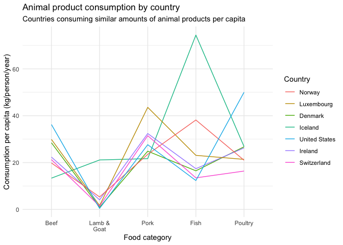
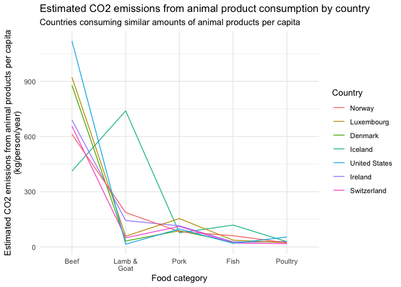

Team Zeta Project 1
================
Angela Sharer
2020-08-03

  - [Food Consumption and CO2
    Emissions](#food-consumption-and-co2-emissions)
      - [Setup](#setup)
      - [Data Wrangling](#data-wrangling)
      - [Analysis](#analysis)
  - [Sources](#sources)

# Food Consumption and CO2 Emissions

Team Zeta Project 1

## Setup

``` r
library(tidyverse)
```

    ## ── Attaching packages ─────────────────────────────────────────────────────────────────────────── tidyverse 1.3.0 ──

    ## ✓ ggplot2 3.3.2     ✓ purrr   0.3.4
    ## ✓ tibble  3.0.1     ✓ dplyr   1.0.0
    ## ✓ tidyr   1.1.0     ✓ stringr 1.4.0
    ## ✓ readr   1.3.1     ✓ forcats 0.5.0

    ## ── Conflicts ────────────────────────────────────────────────────────────────────────────── tidyverse_conflicts() ──
    ## x dplyr::filter() masks stats::filter()
    ## x dplyr::lag()    masks stats::lag()

``` r
library(scales)
```

    ## 
    ## Attaching package: 'scales'

    ## The following object is masked from 'package:purrr':
    ## 
    ##     discard

    ## The following object is masked from 'package:readr':
    ## 
    ##     col_factor

``` r
food_consumption <- readr::read_csv('https://raw.githubusercontent.com/rfordatascience/tidytuesday/master/data/2020/2020-02-18/food_consumption.csv')
```

    ## Parsed with column specification:
    ## cols(
    ##   country = col_character(),
    ##   food_category = col_character(),
    ##   consumption = col_double(),
    ##   co2_emmission = col_double()
    ## )

``` r
gapminder_pop_total <- read_csv("./data/population_total.csv")
```

    ## Parsed with column specification:
    ## cols(
    ##   .default = col_double(),
    ##   country = col_character()
    ## )

    ## See spec(...) for full column specifications.

``` r
gapminder_geo <- read_csv("./data/countries_gapminder.csv")
```

    ## Parsed with column specification:
    ## cols(
    ##   geo = col_character(),
    ##   name = col_character(),
    ##   four_regions = col_character(),
    ##   eight_regions = col_character(),
    ##   six_regions = col_character(),
    ##   members_oecd_g77 = col_character(),
    ##   Latitude = col_double(),
    ##   Longitude = col_double(),
    ##   `UN member since` = col_character(),
    ##   `World bank region` = col_character(),
    ##   `World bank, 4 income groups 2017` = col_character()
    ## )

``` r
gapminder_emissions <- read_csv("./data/co2_emissions_tonnes_per_person.csv")
```

    ## Parsed with column specification:
    ## cols(
    ##   .default = col_double(),
    ##   country = col_character()
    ## )
    ## See spec(...) for full column specifications.

``` r
food_consumption
```

    ## # A tibble: 1,430 x 4
    ##    country   food_category            consumption co2_emmission
    ##    <chr>     <chr>                          <dbl>         <dbl>
    ##  1 Argentina Pork                           10.5          37.2 
    ##  2 Argentina Poultry                        38.7          41.5 
    ##  3 Argentina Beef                           55.5        1712   
    ##  4 Argentina Lamb & Goat                     1.56         54.6 
    ##  5 Argentina Fish                            4.36          6.96
    ##  6 Argentina Eggs                           11.4          10.5 
    ##  7 Argentina Milk - inc. cheese            195.          278.  
    ##  8 Argentina Wheat and Wheat Products      103.           19.7 
    ##  9 Argentina Rice                            8.77         11.2 
    ## 10 Argentina Soybeans                        0             0   
    ## # … with 1,420 more rows

``` r
gapminder_pop_total
```

    ## # A tibble: 195 x 302
    ##    country `1800` `1801` `1802` `1803` `1804` `1805` `1806` `1807` `1808` `1809`
    ##    <chr>    <dbl>  <dbl>  <dbl>  <dbl>  <dbl>  <dbl>  <dbl>  <dbl>  <dbl>  <dbl>
    ##  1 Afghan… 3.28e6 3.28e6 3.28e6 3.28e6 3.28e6 3.28e6 3.28e6 3.28e6 3.28e6 3.28e6
    ##  2 Albania 4.00e5 4.02e5 4.04e5 4.05e5 4.07e5 4.09e5 4.11e5 4.13e5 4.14e5 4.16e5
    ##  3 Algeria 2.50e6 2.51e6 2.52e6 2.53e6 2.54e6 2.55e6 2.56e6 2.56e6 2.57e6 2.58e6
    ##  4 Andorra 2.65e3 2.65e3 2.65e3 2.65e3 2.65e3 2.65e3 2.65e3 2.65e3 2.65e3 2.65e3
    ##  5 Angola  1.57e6 1.57e6 1.57e6 1.57e6 1.57e6 1.57e6 1.57e6 1.57e6 1.57e6 1.57e6
    ##  6 Antigu… 3.70e4 3.70e4 3.70e4 3.70e4 3.70e4 3.70e4 3.70e4 3.70e4 3.70e4 3.70e4
    ##  7 Argent… 5.34e5 5.20e5 5.06e5 4.92e5 4.79e5 4.66e5 4.53e5 4.41e5 4.29e5 4.17e5
    ##  8 Armenia 4.13e5 4.13e5 4.13e5 4.13e5 4.13e5 4.13e5 4.13e5 4.13e5 4.13e5 4.13e5
    ##  9 Austra… 2.00e5 2.05e5 2.11e5 2.16e5 2.22e5 2.27e5 2.33e5 2.39e5 2.46e5 2.52e5
    ## 10 Austria 3.00e6 3.02e6 3.04e6 3.05e6 3.07e6 3.09e6 3.11e6 3.12e6 3.14e6 3.16e6
    ## # … with 185 more rows, and 291 more variables: `1810` <dbl>, `1811` <dbl>,
    ## #   `1812` <dbl>, `1813` <dbl>, `1814` <dbl>, `1815` <dbl>, `1816` <dbl>,
    ## #   `1817` <dbl>, `1818` <dbl>, `1819` <dbl>, `1820` <dbl>, `1821` <dbl>,
    ## #   `1822` <dbl>, `1823` <dbl>, `1824` <dbl>, `1825` <dbl>, `1826` <dbl>,
    ## #   `1827` <dbl>, `1828` <dbl>, `1829` <dbl>, `1830` <dbl>, `1831` <dbl>,
    ## #   `1832` <dbl>, `1833` <dbl>, `1834` <dbl>, `1835` <dbl>, `1836` <dbl>,
    ## #   `1837` <dbl>, `1838` <dbl>, `1839` <dbl>, `1840` <dbl>, `1841` <dbl>,
    ## #   `1842` <dbl>, `1843` <dbl>, `1844` <dbl>, `1845` <dbl>, `1846` <dbl>,
    ## #   `1847` <dbl>, `1848` <dbl>, `1849` <dbl>, `1850` <dbl>, `1851` <dbl>,
    ## #   `1852` <dbl>, `1853` <dbl>, `1854` <dbl>, `1855` <dbl>, `1856` <dbl>,
    ## #   `1857` <dbl>, `1858` <dbl>, `1859` <dbl>, `1860` <dbl>, `1861` <dbl>,
    ## #   `1862` <dbl>, `1863` <dbl>, `1864` <dbl>, `1865` <dbl>, `1866` <dbl>,
    ## #   `1867` <dbl>, `1868` <dbl>, `1869` <dbl>, `1870` <dbl>, `1871` <dbl>,
    ## #   `1872` <dbl>, `1873` <dbl>, `1874` <dbl>, `1875` <dbl>, `1876` <dbl>,
    ## #   `1877` <dbl>, `1878` <dbl>, `1879` <dbl>, `1880` <dbl>, `1881` <dbl>,
    ## #   `1882` <dbl>, `1883` <dbl>, `1884` <dbl>, `1885` <dbl>, `1886` <dbl>,
    ## #   `1887` <dbl>, `1888` <dbl>, `1889` <dbl>, `1890` <dbl>, `1891` <dbl>,
    ## #   `1892` <dbl>, `1893` <dbl>, `1894` <dbl>, `1895` <dbl>, `1896` <dbl>,
    ## #   `1897` <dbl>, `1898` <dbl>, `1899` <dbl>, `1900` <dbl>, `1901` <dbl>,
    ## #   `1902` <dbl>, `1903` <dbl>, `1904` <dbl>, `1905` <dbl>, `1906` <dbl>,
    ## #   `1907` <dbl>, `1908` <dbl>, `1909` <dbl>, …

``` r
gapminder_geo
```

    ## # A tibble: 197 x 11
    ##    geo   name  four_regions eight_regions six_regions members_oecd_g77 Latitude
    ##    <chr> <chr> <chr>        <chr>         <chr>       <chr>               <dbl>
    ##  1 afg   Afgh… asia         asia_west     south_asia  g77                  33  
    ##  2 alb   Alba… europe       europe_east   europe_cen… others               41  
    ##  3 dza   Alge… africa       africa_north  middle_eas… g77                  28  
    ##  4 and   Ando… europe       europe_west   europe_cen… others               42.5
    ##  5 ago   Ango… africa       africa_sub_s… sub_sahara… g77                 -12.5
    ##  6 atg   Anti… americas     america_north america     g77                  17.0
    ##  7 arg   Arge… americas     america_south america     g77                 -34  
    ##  8 arm   Arme… europe       europe_east   europe_cen… others               40.2
    ##  9 aus   Aust… asia         east_asia_pa… east_asia_… oecd                -25  
    ## 10 aut   Aust… europe       europe_west   europe_cen… oecd                 47.3
    ## # … with 187 more rows, and 4 more variables: Longitude <dbl>, `UN member
    ## #   since` <chr>, `World bank region` <chr>, `World bank, 4 income groups
    ## #   2017` <chr>

``` r
gapminder_emissions
```

    ## # A tibble: 192 x 216
    ##    country `1800` `1801` `1802` `1803` `1804` `1805` `1806` `1807` `1808` `1809`
    ##    <chr>    <dbl>  <dbl>  <dbl>  <dbl>  <dbl>  <dbl>  <dbl>  <dbl>  <dbl>  <dbl>
    ##  1 Afghan…     NA     NA     NA     NA     NA     NA     NA NA         NA     NA
    ##  2 Albania     NA     NA     NA     NA     NA     NA     NA NA         NA     NA
    ##  3 Algeria     NA     NA     NA     NA     NA     NA     NA NA         NA     NA
    ##  4 Andorra     NA     NA     NA     NA     NA     NA     NA NA         NA     NA
    ##  5 Angola      NA     NA     NA     NA     NA     NA     NA NA         NA     NA
    ##  6 Antigu…     NA     NA     NA     NA     NA     NA     NA NA         NA     NA
    ##  7 Argent…     NA     NA     NA     NA     NA     NA     NA NA         NA     NA
    ##  8 Armenia     NA     NA     NA     NA     NA     NA     NA NA         NA     NA
    ##  9 Austra…     NA     NA     NA     NA     NA     NA     NA NA         NA     NA
    ## 10 Austria     NA     NA     NA     NA     NA     NA     NA  0.054     NA     NA
    ## # … with 182 more rows, and 205 more variables: `1810` <dbl>, `1811` <dbl>,
    ## #   `1812` <dbl>, `1813` <dbl>, `1814` <dbl>, `1815` <dbl>, `1816` <dbl>,
    ## #   `1817` <dbl>, `1818` <dbl>, `1819` <dbl>, `1820` <dbl>, `1821` <dbl>,
    ## #   `1822` <dbl>, `1823` <dbl>, `1824` <dbl>, `1825` <dbl>, `1826` <dbl>,
    ## #   `1827` <dbl>, `1828` <dbl>, `1829` <dbl>, `1830` <dbl>, `1831` <dbl>,
    ## #   `1832` <dbl>, `1833` <dbl>, `1834` <dbl>, `1835` <dbl>, `1836` <dbl>,
    ## #   `1837` <dbl>, `1838` <dbl>, `1839` <dbl>, `1840` <dbl>, `1841` <dbl>,
    ## #   `1842` <dbl>, `1843` <dbl>, `1844` <dbl>, `1845` <dbl>, `1846` <dbl>,
    ## #   `1847` <dbl>, `1848` <dbl>, `1849` <dbl>, `1850` <dbl>, `1851` <dbl>,
    ## #   `1852` <dbl>, `1853` <dbl>, `1854` <dbl>, `1855` <dbl>, `1856` <dbl>,
    ## #   `1857` <dbl>, `1858` <dbl>, `1859` <dbl>, `1860` <dbl>, `1861` <dbl>,
    ## #   `1862` <dbl>, `1863` <dbl>, `1864` <dbl>, `1865` <dbl>, `1866` <dbl>,
    ## #   `1867` <dbl>, `1868` <dbl>, `1869` <dbl>, `1870` <dbl>, `1871` <dbl>,
    ## #   `1872` <dbl>, `1873` <dbl>, `1874` <dbl>, `1875` <dbl>, `1876` <dbl>,
    ## #   `1877` <dbl>, `1878` <dbl>, `1879` <dbl>, `1880` <dbl>, `1881` <dbl>,
    ## #   `1882` <dbl>, `1883` <dbl>, `1884` <dbl>, `1885` <dbl>, `1886` <dbl>,
    ## #   `1887` <dbl>, `1888` <dbl>, `1889` <dbl>, `1890` <dbl>, `1891` <dbl>,
    ## #   `1892` <dbl>, `1893` <dbl>, `1894` <dbl>, `1895` <dbl>, `1896` <dbl>,
    ## #   `1897` <dbl>, `1898` <dbl>, `1899` <dbl>, `1900` <dbl>, `1901` <dbl>,
    ## #   `1902` <dbl>, `1903` <dbl>, `1904` <dbl>, `1905` <dbl>, `1906` <dbl>,
    ## #   `1907` <dbl>, `1908` <dbl>, `1909` <dbl>, …

## Data Wrangling

``` r
gapminder_pop_2014 <-
  gapminder_pop_total %>%
  select("country", "population" = "2014")

gapminder_pop_2014
```

    ## # A tibble: 195 x 2
    ##    country             population
    ##    <chr>                    <dbl>
    ##  1 Afghanistan           33400000
    ##  2 Albania                2900000
    ##  3 Algeria               38900000
    ##  4 Andorra                  79200
    ##  5 Angola                26900000
    ##  6 Antigua and Barbuda      92600
    ##  7 Argentina             42600000
    ##  8 Armenia                2910000
    ##  9 Australia             23600000
    ## 10 Austria                8620000
    ## # … with 185 more rows

``` r
gapminder_geo_select <-
  gapminder_geo %>%
  select(
    "country" = "name", 
    "region" = "World bank region", 
    "income_grp" = "World bank, 4 income groups 2017"
  )

gapminder_geo_select
```

    ## # A tibble: 197 x 3
    ##    country             region                     income_grp         
    ##    <chr>               <chr>                      <chr>              
    ##  1 Afghanistan         South Asia                 Low income         
    ##  2 Albania             Europe & Central Asia      Upper middle income
    ##  3 Algeria             Middle East & North Africa Upper middle income
    ##  4 Andorra             Europe & Central Asia      High income        
    ##  5 Angola              Sub-Saharan Africa         Lower middle income
    ##  6 Antigua and Barbuda Latin America & Caribbean  High income        
    ##  7 Argentina           Latin America & Caribbean  Upper middle income
    ##  8 Armenia             Europe & Central Asia      Lower middle income
    ##  9 Australia           East Asia & Pacific        High income        
    ## 10 Austria             Europe & Central Asia      High income        
    ## # … with 187 more rows

``` r
gapminder_emissions_2014 <-
  gapminder_emissions %>%
  select("country", "total_co2_tonnes" = "2014") %>%
  mutate(total_co2_emissions = total_co2_tonnes * 1000) %>%
  select("country", "total_co2_emissions")

gapminder_emissions_2014
```

    ## # A tibble: 192 x 2
    ##    country             total_co2_emissions
    ##    <chr>                             <dbl>
    ##  1 Afghanistan                         294
    ##  2 Albania                            1970
    ##  3 Algeria                            3740
    ##  4 Andorra                            5830
    ##  5 Angola                             1290
    ##  6 Antigua and Barbuda                5740
    ##  7 Argentina                          4790
    ##  8 Armenia                            1900
    ##  9 Australia                         15300
    ## 10 Austria                            6810
    ## # … with 182 more rows

``` r
## First, I'm fixing the USA
food_consumption_US_only <-
  food_consumption %>%
  filter(country == "USA") %>%
  select(-country) %>%
  mutate(country = "United States") %>%
  select(country, food_category, consumption, co2_emmission)

## Next, I'm fixing Hong Kong
food_consumption_HK_only <-
  food_consumption %>%
  filter(country == "Hong Kong SAR. China") %>%
  select(-country) %>%
  mutate(country = "Hong Kong, China") %>%
  select(country, food_category, consumption, co2_emmission)

## Next, I'm fixing Taiwan
food_consumption_TW_only <-
  food_consumption %>%
  filter(country == "Taiwan. ROC") %>%
  select(-country) %>%
  mutate(country = "Taiwan") %>%
  select(country, food_category, consumption, co2_emmission)

## Macedonia (Macedonia, FYR in gapminder)
food_consumption_Macedonia_only <-
  food_consumption %>%
  filter(country == "Macedonia") %>%
  select(-country) %>%
  mutate(country = "Macedonia, FYR") %>%
  select(country, food_category, consumption, co2_emmission)

## Congo, Rep.
food_consumption_CongoRep_only <-
  food_consumption %>%
  filter(country == "Congo") %>%
  select(-country) %>%
  mutate(country = "Congo, Rep.") %>%
  select(country, food_category, consumption, co2_emmission)


## Now, I'm binding them all together!
food_consumption_mod <-
  food_consumption %>%
  filter(
    country != "USA" &
    country != "Hong Kong SAR. China" &
    country != "Taiwan. ROC" &
    country != "Macedonia" &
    country != "Congo"
  ) %>%
  bind_rows(
    food_consumption_US_only,
    food_consumption_HK_only,
    food_consumption_TW_only,
    food_consumption_Macedonia_only,
    food_consumption_CongoRep_only
    )
```

``` r
df_food_all <-
  food_consumption_mod %>%
  left_join(gapminder_pop_2014, by = "country") %>%
  left_join(gapminder_geo_select, by = "country") %>%
  left_join(gapminder_emissions_2014, by = "country") %>%
  group_by(country) %>%
  mutate(
    co2_food_country = sum(co2_emmission), 
    food_consumption_country = sum(consumption)
  ) %>%
  ungroup() %>%
  select(
    region,
    country,
    population,
    income_grp,
    food_category,
    consumption,
    food_consumption_country,
    "co2_emission_food" = co2_emmission,
    co2_food_country,
    total_co2_emissions
  )

df_food_all
```

    ## # A tibble: 1,430 x 10
    ##    region country population income_grp food_category consumption
    ##    <chr>  <chr>        <dbl> <chr>      <chr>               <dbl>
    ##  1 Latin… Argent…   42600000 Upper mid… Pork                10.5 
    ##  2 Latin… Argent…   42600000 Upper mid… Poultry             38.7 
    ##  3 Latin… Argent…   42600000 Upper mid… Beef                55.5 
    ##  4 Latin… Argent…   42600000 Upper mid… Lamb & Goat          1.56
    ##  5 Latin… Argent…   42600000 Upper mid… Fish                 4.36
    ##  6 Latin… Argent…   42600000 Upper mid… Eggs                11.4 
    ##  7 Latin… Argent…   42600000 Upper mid… Milk - inc. …      195.  
    ##  8 Latin… Argent…   42600000 Upper mid… Wheat and Wh…      103.  
    ##  9 Latin… Argent…   42600000 Upper mid… Rice                 8.77
    ## 10 Latin… Argent…   42600000 Upper mid… Soybeans             0   
    ## # … with 1,420 more rows, and 4 more variables: food_consumption_country <dbl>,
    ## #   co2_emission_food <dbl>, co2_food_country <dbl>, total_co2_emissions <dbl>

``` r
#View(df_food_all[is.na(df_food_all$region),])
## Gapminder is missing these countries, which are present in food_consumption:
## Bermuda, French Polynesia, New Caledonia, Slovakia
```

Based on some initial explorations, we decided to focus on animal
products only.

``` r
df_food_animal <-
  df_food_all %>%
  select(-co2_food_country, -food_consumption_country) %>%
  filter(
    food_category %in% c(
      "Beef", "Fish", "Lamb & Goat", "Pork", "Poultry", 
      "Eggs", "Milk - inc. cheese"
    ) 
  ) %>%
  group_by(country) %>%
  mutate(
    co2_food_animal_country = sum(co2_emission_food), 
    food_animal_consumption_country = sum(consumption)
  ) %>%
  ungroup() %>%
  group_by(food_category) %>%
  mutate(
    mean_consumption_cat = mean(consumption)
  ) %>%
  ungroup()

## We will mostly focus in on wealthy countries only, but I wanted to preserve the full income range first, to make some visualiziations that will situate those countries relative to the others.
df_food_animal_high_income <-
  df_food_animal %>%
  filter(income_grp == "High income") %>%
  group_by(food_category) %>%
  mutate(
    mean_consumption_cat_hi = mean(consumption)
  ) %>%
  ungroup()
```

``` r
df_food_animal_wide <-
  df_food_animal %>%
  select(-co2_emission_food, -mean_consumption_cat) %>%
  pivot_wider(
    names_from = food_category,
    values_from = consumption
  )

df_food_animal_wide
```

    ## # A tibble: 130 x 14
    ##    region country population income_grp total_co2_emiss… co2_food_animal…
    ##    <chr>  <chr>        <dbl> <chr>                 <dbl>            <dbl>
    ##  1 Latin… Argent…   42600000 Upper mid…             4790            2141.
    ##  2 East … Austra…   23600000 High inco…            15300            1896.
    ##  3 Europ… Albania    2900000 Upper mid…             1970            1734.
    ##  4 Europ… Iceland     329000 High inco…             6040            1706.
    ##  5 East … New Ze…    4570000 High inco…             7590            1710.
    ##  6 Latin… Uruguay    3400000 High inco…             1980            1598.
    ##  7 Europ… Luxemb…     555000 High inco…            17400            1572.
    ##  8 Latin… Brazil   203000000 Upper mid…             2610            1563.
    ##  9 Europ… Kazakh…   17300000 Upper mid…            14400            1539.
    ## 10 Europ… Sweden     9690000 High inco…             4480            1493.
    ## # … with 120 more rows, and 8 more variables:
    ## #   food_animal_consumption_country <dbl>, Pork <dbl>, Poultry <dbl>,
    ## #   Beef <dbl>, `Lamb & Goat` <dbl>, Fish <dbl>, Eggs <dbl>, `Milk - inc.
    ## #   cheese` <dbl>

## Analysis

``` r
df_food_animal %>%
  filter(!is.na(region)) %>%
  ggplot() +
  geom_point(
    aes(
      co2_food_animal_country, 
      food_animal_consumption_country, 
      color = fct_reorder(income_grp, desc(consumption))
    )
  ) +
  scale_color_discrete(name = "Country's income level") +
  labs(
    title = "Animal product consumption and estimated resulting CO2 emissions per capita",
    x = "Estimated CO2 emissions per capita from animal products\n(kg CO2/person/year)",
    y = "Animal product consumption per capita\n(kg/person/year)"
  ) + 
  theme_minimal()
```

<!-- -->

``` r
df_food_animal %>%
  filter(!is.na(region)) %>%
  ggplot() +
  geom_point(
    aes(
      co2_food_animal_country, 
      food_animal_consumption_country, 
      color = region
    )
  ) +
  scale_color_discrete(name = "Region") +
  labs(
    title = "Animal product consumption and resulting estimated CO2 emissions per capita",
    x = "Estimated CO2 emissions from animal products per capita\n(kg CO2/person/year)",
    y = "Animal product consumption per capita\n(kg/person/year)"
  ) + 
  theme_minimal()
```

<!-- -->

``` r
df_food_animal_wide %>%
  filter(!is.na(region)) %>%
  ggplot() +
  geom_point(
    aes(
      co2_food_animal_country, 
      food_animal_consumption_country, 
      color = Beef
    )
  ) +
  scale_color_continuous(name = "Beef consumption\n(kg/person/year)") +
  labs(
    title = "Animal product consumption and resulting estimated CO2 emissions per capita",
    x = "Est. CO2 emissions from animal products per capita\n(kg CO2/person/year)",
    y = "Animal product consumption per capita\n(kg/person/year)"
  ) + 
  theme_minimal()
```

<!-- -->

``` r
df_food_animal_high_income %>%
  filter(!is.na(region)) %>%
  ggplot() +
  geom_point(
    aes(
      co2_food_animal_country, 
      food_animal_consumption_country, 
      color = region
    )
  ) +
  scale_color_discrete(name = "Region") +
  labs(
    title = "Animal products consumption and resulting est. CO2 emissions per capita",
    subtitle = "High income countries only",
    x = "Estimated CO2 emissions from animal products per capita\n(kg CO2/person/year)",
    y = "Animal product consumption per capita\n(kg/person/year)"
  ) + 
  theme_minimal()
```

<!-- -->

``` r
df_food_animal_wide %>%
  filter(!is.na(region) & income_grp == "High income") %>%
  ggplot() +
  geom_point(
    aes(
      co2_food_animal_country, 
      food_animal_consumption_country, 
      color = Beef
    )
  ) +
  scale_color_continuous(name = "Beef consumption\n(kg/person/year)") +
  labs(
    title = "Animal products consumption and resulting estimated CO2 emissions per capita",
    subtitle = "High income countries only",
    x = "Estimated CO2 emissions from animal products per capita\n(kg CO2/person/year)",
    y = "Animal products consumption per capita\n(kg/person/year)"
  ) + 
  theme_minimal()
```

<!-- -->

``` r
df_food_animal_wide %>%
  filter(!is.na(region) & income_grp == "High income") %>%
  ggplot() +
  geom_point(
    aes(
      Beef,
      co2_food_animal_country, 
      color = Beef
    )
  ) +
  scale_color_continuous(name = "Beef consumption\n(kg/person/year)") +
  labs(
    title = "Beef consumption and estimated CO2 emissions from animal products per capita",
    subtitle = "High income countries only",
    x = "Beef consumption per capita (kg/person/year)",
    y = "Estimated CO2 emissions from animal products\nper capita (kg CO2/person/year)"
  ) + 
  theme_minimal()
```

<!-- -->

``` r
df_food_animal %>%
  ggplot() +
  geom_boxplot(aes(consumption, fct_reorder(food_category, mean_consumption_cat))) +
  labs(
    title = "Consumption per capita by food category, animal products only",
    x = "Food consumption per capita (kg/person/year)",
    y = "Food Category"
  ) + 
  theme_minimal()
```

<!-- -->

``` r
df_food_animal_high_income %>%
  ggplot() +
  geom_boxplot(
    aes(consumption, fct_reorder(food_category, mean_consumption_cat_hi))
  ) +
  labs(
    title = "Consumption per capita by food category, animal products only",
    subtitle = "High income countries only",
    x = "Food consumption per capita (kg/person/year)",
    y = "Food Category"
  ) + 
  theme_minimal()
```

<!-- -->

``` r
df_food_all %>%
  filter(food_category == "Milk - inc. cheese") %>%
  arrange(desc(consumption))
```

    ## # A tibble: 130 x 10
    ##    region country population income_grp food_category consumption
    ##    <chr>  <chr>        <dbl> <chr>      <chr>               <dbl>
    ##  1 Europ… Finland    5460000 High inco… Milk - inc. …        431.
    ##  2 Europ… Nether…   16900000 High inco… Milk - inc. …        341.
    ##  3 Europ… Sweden     9690000 High inco… Milk - inc. …        341.
    ##  4 Europ… Switze…    8210000 High inco… Milk - inc. …        319.
    ##  5 Europ… Albania    2900000 Upper mid… Milk - inc. …        304.
    ##  6 Europ… Lithua…    2970000 High inco… Milk - inc. …        295.
    ##  7 Europ… Ireland    4630000 High inco… Milk - inc. …        292.
    ##  8 Europ… Kazakh…   17300000 Upper mid… Milk - inc. …        288.
    ##  9 Europ… Estonia    1320000 High inco… Milk - inc. …        285.
    ## 10 Europ… Denmark    5660000 High inco… Milk - inc. …        277.
    ## # … with 120 more rows, and 4 more variables: food_consumption_country <dbl>,
    ## #   co2_emission_food <dbl>, co2_food_country <dbl>, total_co2_emissions <dbl>

``` r
df_food_all %>%
  filter(country == "Finland") %>%
  ggplot() +
  geom_col(aes(fct_reorder(food_category, desc(consumption)), consumption)) +
  scale_x_discrete(
    labels = function(food_category) str_wrap(food_category, width = 10)
  ) +
  labs(
    title = "Finland's food consumption per capita, select categories",
    x = "Food category",
    y = "Consumption per person per year"
  ) + 
  theme_minimal()
```

<!-- -->

``` r
df_food_animal %>%
  filter(!is.na(income_grp)) %>%
  ggplot() +
  geom_point(
    aes(
      co2_food_animal_country, 
      total_co2_emissions, 
      color = fct_reorder(income_grp, desc(consumption))
    ), na.rm = TRUE
  ) +
  scale_color_discrete(name = "Country's income level") +
  #coord_trans(x = "log", y = "log") +
  labs(
    title = "CO2 emissions per capita from animal products vs. overall",
    x = "Estimated CO2 emissions from animal products per capita\n(kg CO2/person/year)",
    y = "Total CO2 emissions per capita\n(kg CO2/person/year)"
  ) + 
  theme_minimal()
```

<!-- -->

``` r
df_food_animal_wide %>%
  filter(!is.na(income_grp)) %>%
  ggplot() +
  geom_point(
    aes(
      co2_food_animal_country, 
      total_co2_emissions, 
      color = Beef,
    ), na.rm = TRUE
  ) +
  scale_color_continuous(name = "Beef consumption\n(kg/person/year)") +
  labs(
    title = "CO2 emissions per capita from animal products vs. overall",
    x = "Estimated CO2 emissions from animal products per capita\n(kg CO2/person/year)",
    y = "Total CO2 emissions per capita\n(kg CO2/person/year)"
  ) + 
  theme_minimal()
```

<!-- -->

``` r
df_food_animal_wide %>%
  filter(!is.na(income_grp)) %>%
  filter(income_grp == "High income") %>%
  ggplot() +
  geom_point(
    aes(
      co2_food_animal_country, 
      total_co2_emissions, 
      color = Beef,
    ), na.rm = TRUE
  ) +
  scale_color_continuous(name = "Beef consumption\n(kg/person/year)") +
  labs(
    title = "CO2 emissions per capita from animal products vs. overall",
    subtitle = "High income countries only",
    x = "Estimated CO2 emissions from animal products per capita\n(kg CO2/person/year)",
    y = "Total CO2 emissions per capita\n(kg CO2/person/year)"
  ) + 
  theme_minimal()
```

<!-- -->

``` r
df_food_animal_cohort <-
  df_food_animal_high_income %>%
  filter(
    food_animal_consumption_country > 375 & 
    food_animal_consumption_country < 415
  ) %>%
  group_by(food_category) %>%
  mutate(
    mean_consumption_cohort = mean(consumption),
    mean_co2_em_food_cohort = mean(co2_emission_food)
  ) %>%
  ungroup() 
  
df_food_animal_cohort %>%
  filter(   
    food_category != "Milk - inc. cheese" &
    food_category != "Eggs" 
  ) %>%
  ggplot() +
  geom_line(
    aes(
      fct_relevel(food_category, "Beef", "Lamb & Goat", "Pork", "Fish", "Poultry"),
    #  fct_reorder(food_category, desc(co2_emission_food)),
      consumption,
      group = country,
      color = fct_reorder(country, food_animal_consumption_country)
    )
  ) + 
  scale_x_discrete(
    labels = function(food_category) str_wrap(food_category, width = 10)
  ) +
  scale_color_discrete(name = "Country") +
  labs(
    title = "Animal product consumption by country",
    subtitle = "Countries consuming similar amounts of animal products per capita",
    x = "Food category",
    y = "Consumption per capita (kg/person/year)"
  ) +
  theme_minimal()
```

<!-- -->

``` r
df_food_animal_cohort 
```

    ## # A tibble: 49 x 14
    ##    region country population income_grp food_category consumption
    ##    <chr>  <chr>        <dbl> <chr>      <chr>               <dbl>
    ##  1 Europ… Iceland     329000 High inco… Pork                21.7 
    ##  2 Europ… Iceland     329000 High inco… Poultry             26.9 
    ##  3 Europ… Iceland     329000 High inco… Beef                13.4 
    ##  4 Europ… Iceland     329000 High inco… Lamb & Goat         21.1 
    ##  5 Europ… Iceland     329000 High inco… Fish                74.4 
    ##  6 Europ… Iceland     329000 High inco… Eggs                 8.24
    ##  7 Europ… Iceland     329000 High inco… Milk - inc. …      226.  
    ##  8 Europ… Luxemb…     555000 High inco… Pork                43.6 
    ##  9 Europ… Luxemb…     555000 High inco… Poultry             21.4 
    ## 10 Europ… Luxemb…     555000 High inco… Beef                29.9 
    ## # … with 39 more rows, and 8 more variables: co2_emission_food <dbl>,
    ## #   total_co2_emissions <dbl>, co2_food_animal_country <dbl>,
    ## #   food_animal_consumption_country <dbl>, mean_consumption_cat <dbl>,
    ## #   mean_consumption_cat_hi <dbl>, mean_consumption_cohort <dbl>,
    ## #   mean_co2_em_food_cohort <dbl>

``` r
df_food_animal_high_income %>%
  filter(
    food_animal_consumption_country > 375 & 
    food_animal_consumption_country < 415 &
    food_category != "Milk - inc. cheese" &
    food_category != "Eggs" 
  ) %>%
  group_by(food_category) %>%
  mutate(
    mean_consumption_cohort = mean(consumption),
    mean_co2_em_food_cohort = mean(co2_emission_food)
  ) %>%
  ungroup() %>%
  ggplot() +
  geom_line(
    aes(fct_reorder(food_category, desc(mean_co2_em_food_cohort)),
      co2_emission_food,
      group = country,
      color = fct_reorder(country, food_animal_consumption_country)
    )
  ) + 
  scale_x_discrete(
    labels = function(food_category) str_wrap(food_category, width = 10)
  ) +
  scale_color_discrete(name = "Country") +
  labs(
    title = "Estimated CO2 emissions from animal product consumption by country",
    subtitle = "Countries consuming similar amounts of animal products per capita",
    x = "Food category",
    y = "Estimated CO2 emissions from animal products per capita\n(kg/person/year)"
  ) +
  theme_minimal()
```

<!-- -->

``` r
df_food_animal_high_income
```

    ## # A tibble: 315 x 12
    ##    region country population income_grp food_category consumption
    ##    <chr>  <chr>        <dbl> <chr>      <chr>               <dbl>
    ##  1 East … Austra…   23600000 High inco… Pork                24.1 
    ##  2 East … Austra…   23600000 High inco… Poultry             46.1 
    ##  3 East … Austra…   23600000 High inco… Beef                33.9 
    ##  4 East … Austra…   23600000 High inco… Lamb & Goat          9.87
    ##  5 East … Austra…   23600000 High inco… Fish                17.7 
    ##  6 East … Austra…   23600000 High inco… Eggs                 8.51
    ##  7 East … Austra…   23600000 High inco… Milk - inc. …      234.  
    ##  8 Europ… Iceland     329000 High inco… Pork                21.7 
    ##  9 Europ… Iceland     329000 High inco… Poultry             26.9 
    ## 10 Europ… Iceland     329000 High inco… Beef                13.4 
    ## # … with 305 more rows, and 6 more variables: co2_emission_food <dbl>,
    ## #   total_co2_emissions <dbl>, co2_food_animal_country <dbl>,
    ## #   food_animal_consumption_country <dbl>, mean_consumption_cat <dbl>,
    ## #   mean_consumption_cat_hi <dbl>

``` r
df_food_animal_cohort %>%
  filter(country %in% c("United States", "Switzerland")) %>%
  ggplot() +
  geom_line(
    aes(
    #  fct_relevel(food_category, "Beef", "Lamb & Goat", "Pork", "Fish", "Poultry"),
    #  fct_reorder(food_category, desc(co2_emission_food)),
      fct_reorder(food_category, desc(mean_consumption_cat_hi)),
      consumption,
      group = country,
      color = fct_reorder(country, food_animal_consumption_country)
    )
  ) + 
  scale_x_discrete(
    labels = function(food_category) str_wrap(food_category, width = 10)
  ) +
  scale_color_discrete(name = "Country") +
  labs(
    title = "Animal product consumption by country",
    subtitle = "Countries consuming similar amounts of animal products per capita",
    x = "Food category",
    y = "Consumption per capita (kg/person/year)"
  ) +
  theme_minimal()
```

<!-- -->

``` r
df_food_animal_wide %>%
  filter(!is.na(region) & income_grp == "High income") %>%
  ggplot() +
  geom_point(
    aes(
      Beef,
      Pork, 
      color = co2_food_animal_country
    )
  ) +
  scale_color_continuous(name = "Est. CO2 emissions from\nanimal products per capita\n(kg CO2/person/year)") +
  labs(
    title = "Beef and Pork consumption per capita",
    subtitle = "High income countries only",
    x = "Beef consumption per capita (kg/person/year)",
    y = "Pork consumption per capita (kg/person/year)"
  ) + 
  theme_minimal()
```

<!-- -->

``` r
df_food_animal_wide %>%
  filter(!is.na(region) & income_grp == "High income") %>%
  ggplot() +
  geom_point(
    aes(
      Beef,
      Poultry, 
      color = co2_food_animal_country
    )
  ) +
  scale_color_continuous(name = "Est. CO2 emissions from\nanimal products per capita\n(kg CO2/person/year)") +
  labs(
    title = "Beef and Poultry consumption per capita",
    subtitle = "High income countries only",
    x = "Beef consumption per capita (kg/person/year)",
    y = "Poultry consumption per capita (kg/person/year)"
  ) + 
  theme_minimal()
```

<!-- -->

``` r
df_food_animal_wide %>%
  filter(!is.na(region) & income_grp == "High income") %>%
  ggplot() +
  geom_point(
    aes(
      Beef,
      Fish, 
      color = co2_food_animal_country
    )
  ) +
  scale_color_continuous(name = "Est. CO2 emissions from\nanimal products per capita\n(kg CO2/person/year)") +
  labs(
    title = "Beef and Fish consumption per capita",
    subtitle = "High income countries only",
    x = "Beef consumption per capita (kg/person/year)",
    y = "Fish consumption per capita (kg/person/year)"
  ) + 
  theme_minimal()
```

<!-- -->

``` r
df_food_animal_wide %>%
  filter(!is.na(region) & income_grp == "High income") %>%
  ggplot() +
  geom_point(
    aes(
      Beef,
      `Lamb & Goat`,
      color = co2_food_animal_country
    )
  ) +
  scale_color_continuous(name = "Est. CO2 emissions from\nanimal products per capita\n(kg CO2/person/year)") +
  labs(
    title = "Beef and Lamb & Goat consumption per capita",
    subtitle = "High income countries only",
    x = "Beef consumption per capita (kg/person/year)",
    y = "Lamb & Goat consumption per capita (kg/person/year)"
  ) + 
  theme_minimal()
```

<!-- -->

``` r
df_food_animal_wide %>%
  filter(!is.na(region) & income_grp == "High income") %>%
  ggplot() +
  geom_point(
    aes(
      Beef,
      Eggs,
      color = co2_food_animal_country
    )
  ) +
  scale_color_continuous(name = "Est. CO2 emissions from\nanimal products per capita\n(kg CO2/person/year)") +
  labs(
    title = "Beef and Eggs consumption per capita",
    subtitle = "High income countries only",
    x = "Beef consumption per capita (kg/person/year)",
    y = "Eggs consumption per capita (kg/person/year)"
  ) + 
  theme_minimal()
```

<!-- -->

``` r
df_food_animal_wide %>%
  filter(!is.na(region) & income_grp == "High income") %>%
  ggplot() +
  geom_point(
    aes(
      Beef,
      `Milk - inc. cheese`,
      color = co2_food_animal_country
    )
  ) +
  scale_color_continuous(name = "Est. CO2 emissions from\nanimal products per capita\n(kg CO2/person/year)") +
  labs(
    title = "Beef and Dairy consumption per capita",
    subtitle = "High income countries only",
    x = "Beef consumption per capita (kg/person/year)",
    y = "Dairy consumption per capita (kg/person/year)"
  ) + 
  theme_minimal()
```

<!-- -->

*Other ideas for graphs:* - Worst emitters breakdown - Lowest emitters
breakdown - Milk vs. GDP? - co2 emissions vs. gdp

# Sources

We downloaded the data on food consumption and CO2 emissions from Tidy
Tuesday on Github, but that data came from another source, who
originally got it from the Food and Agriculture Organization of the
United Nations.

  - [Food consumption data, tidy
    format](https://github.com/rfordatascience/tidytuesday/blob/master/data/2020/2020-02-18/readme.md)
  - [Food consumption data,
    source](https://www.nu3.de/blogs/nutrition/food-carbon-footprint-index-2018)
  - [Food consumption data, original
    source](http://www.fao.org/faostat/en/#data)

We merged in some additional data on population, income, etc. from
Gapminder.

  - [Gapminder](https://www.gapminder.org/data/)
