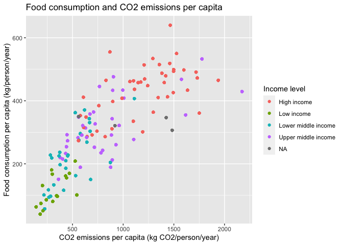

Team Zeta Project 1
================
Angela Sharer
2020-08-03

  - [Food Consumption and CO2
    Emissions](#food-consumption-and-co2-emissions)
  - [Sources](#sources)

# Food Consumption and CO2 Emissions

Team Zeta Project 1

``` r
library(tidyverse)
```

    ## ── Attaching packages ─────────────────────────────────────────────────────────────────────────── tidyverse 1.3.0 ──

    ## ✓ ggplot2 3.3.2     ✓ purrr   0.3.4
    ## ✓ tibble  3.0.1     ✓ dplyr   1.0.0
    ## ✓ tidyr   1.1.0     ✓ stringr 1.4.0
    ## ✓ readr   1.3.1     ✓ forcats 0.5.0

    ## ── Conflicts ────────────────────────────────────────────────────────────────────────────── tidyverse_conflicts() ──
    ## x dplyr::filter() masks stats::filter()
    ## x dplyr::lag()    masks stats::lag()

``` r
food_consumption <- readr::read_csv('https://raw.githubusercontent.com/rfordatascience/tidytuesday/master/data/2020/2020-02-18/food_consumption.csv')
```

    ## Parsed with column specification:
    ## cols(
    ##   country = col_character(),
    ##   food_category = col_character(),
    ##   consumption = col_double(),
    ##   co2_emmission = col_double()
    ## )

``` r
gapminder_pop_total <- read_csv("./data/population_total.csv")
```

    ## Parsed with column specification:
    ## cols(
    ##   .default = col_double(),
    ##   country = col_character()
    ## )

    ## See spec(...) for full column specifications.

``` r
gapminder_geo <- read_csv("./data/countries_gapminder.csv")
```

    ## Parsed with column specification:
    ## cols(
    ##   geo = col_character(),
    ##   name = col_character(),
    ##   four_regions = col_character(),
    ##   eight_regions = col_character(),
    ##   six_regions = col_character(),
    ##   members_oecd_g77 = col_character(),
    ##   Latitude = col_double(),
    ##   Longitude = col_double(),
    ##   `UN member since` = col_character(),
    ##   `World bank region` = col_character(),
    ##   `World bank, 4 income groups 2017` = col_character()
    ## )

``` r
food_consumption
```

    ## # A tibble: 1,430 x 4
    ##    country   food_category            consumption co2_emmission
    ##    <chr>     <chr>                          <dbl>         <dbl>
    ##  1 Argentina Pork                           10.5          37.2 
    ##  2 Argentina Poultry                        38.7          41.5 
    ##  3 Argentina Beef                           55.5        1712   
    ##  4 Argentina Lamb & Goat                     1.56         54.6 
    ##  5 Argentina Fish                            4.36          6.96
    ##  6 Argentina Eggs                           11.4          10.5 
    ##  7 Argentina Milk - inc. cheese            195.          278.  
    ##  8 Argentina Wheat and Wheat Products      103.           19.7 
    ##  9 Argentina Rice                            8.77         11.2 
    ## 10 Argentina Soybeans                        0             0   
    ## # … with 1,420 more rows

``` r
gapminder_pop_total
```

    ## # A tibble: 195 x 302
    ##    country `1800` `1801` `1802` `1803` `1804` `1805` `1806` `1807` `1808` `1809`
    ##    <chr>    <dbl>  <dbl>  <dbl>  <dbl>  <dbl>  <dbl>  <dbl>  <dbl>  <dbl>  <dbl>
    ##  1 Afghan… 3.28e6 3.28e6 3.28e6 3.28e6 3.28e6 3.28e6 3.28e6 3.28e6 3.28e6 3.28e6
    ##  2 Albania 4.00e5 4.02e5 4.04e5 4.05e5 4.07e5 4.09e5 4.11e5 4.13e5 4.14e5 4.16e5
    ##  3 Algeria 2.50e6 2.51e6 2.52e6 2.53e6 2.54e6 2.55e6 2.56e6 2.56e6 2.57e6 2.58e6
    ##  4 Andorra 2.65e3 2.65e3 2.65e3 2.65e3 2.65e3 2.65e3 2.65e3 2.65e3 2.65e3 2.65e3
    ##  5 Angola  1.57e6 1.57e6 1.57e6 1.57e6 1.57e6 1.57e6 1.57e6 1.57e6 1.57e6 1.57e6
    ##  6 Antigu… 3.70e4 3.70e4 3.70e4 3.70e4 3.70e4 3.70e4 3.70e4 3.70e4 3.70e4 3.70e4
    ##  7 Argent… 5.34e5 5.20e5 5.06e5 4.92e5 4.79e5 4.66e5 4.53e5 4.41e5 4.29e5 4.17e5
    ##  8 Armenia 4.13e5 4.13e5 4.13e5 4.13e5 4.13e5 4.13e5 4.13e5 4.13e5 4.13e5 4.13e5
    ##  9 Austra… 2.00e5 2.05e5 2.11e5 2.16e5 2.22e5 2.27e5 2.33e5 2.39e5 2.46e5 2.52e5
    ## 10 Austria 3.00e6 3.02e6 3.04e6 3.05e6 3.07e6 3.09e6 3.11e6 3.12e6 3.14e6 3.16e6
    ## # … with 185 more rows, and 291 more variables: `1810` <dbl>, `1811` <dbl>,
    ## #   `1812` <dbl>, `1813` <dbl>, `1814` <dbl>, `1815` <dbl>, `1816` <dbl>,
    ## #   `1817` <dbl>, `1818` <dbl>, `1819` <dbl>, `1820` <dbl>, `1821` <dbl>,
    ## #   `1822` <dbl>, `1823` <dbl>, `1824` <dbl>, `1825` <dbl>, `1826` <dbl>,
    ## #   `1827` <dbl>, `1828` <dbl>, `1829` <dbl>, `1830` <dbl>, `1831` <dbl>,
    ## #   `1832` <dbl>, `1833` <dbl>, `1834` <dbl>, `1835` <dbl>, `1836` <dbl>,
    ## #   `1837` <dbl>, `1838` <dbl>, `1839` <dbl>, `1840` <dbl>, `1841` <dbl>,
    ## #   `1842` <dbl>, `1843` <dbl>, `1844` <dbl>, `1845` <dbl>, `1846` <dbl>,
    ## #   `1847` <dbl>, `1848` <dbl>, `1849` <dbl>, `1850` <dbl>, `1851` <dbl>,
    ## #   `1852` <dbl>, `1853` <dbl>, `1854` <dbl>, `1855` <dbl>, `1856` <dbl>,
    ## #   `1857` <dbl>, `1858` <dbl>, `1859` <dbl>, `1860` <dbl>, `1861` <dbl>,
    ## #   `1862` <dbl>, `1863` <dbl>, `1864` <dbl>, `1865` <dbl>, `1866` <dbl>,
    ## #   `1867` <dbl>, `1868` <dbl>, `1869` <dbl>, `1870` <dbl>, `1871` <dbl>,
    ## #   `1872` <dbl>, `1873` <dbl>, `1874` <dbl>, `1875` <dbl>, `1876` <dbl>,
    ## #   `1877` <dbl>, `1878` <dbl>, `1879` <dbl>, `1880` <dbl>, `1881` <dbl>,
    ## #   `1882` <dbl>, `1883` <dbl>, `1884` <dbl>, `1885` <dbl>, `1886` <dbl>,
    ## #   `1887` <dbl>, `1888` <dbl>, `1889` <dbl>, `1890` <dbl>, `1891` <dbl>,
    ## #   `1892` <dbl>, `1893` <dbl>, `1894` <dbl>, `1895` <dbl>, `1896` <dbl>,
    ## #   `1897` <dbl>, `1898` <dbl>, `1899` <dbl>, `1900` <dbl>, `1901` <dbl>,
    ## #   `1902` <dbl>, `1903` <dbl>, `1904` <dbl>, `1905` <dbl>, `1906` <dbl>,
    ## #   `1907` <dbl>, `1908` <dbl>, `1909` <dbl>, …

``` r
gapminder_geo
```

    ## # A tibble: 197 x 11
    ##    geo   name  four_regions eight_regions six_regions members_oecd_g77 Latitude
    ##    <chr> <chr> <chr>        <chr>         <chr>       <chr>               <dbl>
    ##  1 afg   Afgh… asia         asia_west     south_asia  g77                  33  
    ##  2 alb   Alba… europe       europe_east   europe_cen… others               41  
    ##  3 dza   Alge… africa       africa_north  middle_eas… g77                  28  
    ##  4 and   Ando… europe       europe_west   europe_cen… others               42.5
    ##  5 ago   Ango… africa       africa_sub_s… sub_sahara… g77                 -12.5
    ##  6 atg   Anti… americas     america_north america     g77                  17.0
    ##  7 arg   Arge… americas     america_south america     g77                 -34  
    ##  8 arm   Arme… europe       europe_east   europe_cen… others               40.2
    ##  9 aus   Aust… asia         east_asia_pa… east_asia_… oecd                -25  
    ## 10 aut   Aust… europe       europe_west   europe_cen… oecd                 47.3
    ## # … with 187 more rows, and 4 more variables: Longitude <dbl>, `UN member
    ## #   since` <chr>, `World bank region` <chr>, `World bank, 4 income groups
    ## #   2017` <chr>

``` r
gapminder_pop_2014 <-
  gapminder_pop_total %>%
  select("country", "population" = "2014")

gapminder_pop_2014
```

    ## # A tibble: 195 x 2
    ##    country             population
    ##    <chr>                    <dbl>
    ##  1 Afghanistan           33400000
    ##  2 Albania                2900000
    ##  3 Algeria               38900000
    ##  4 Andorra                  79200
    ##  5 Angola                26900000
    ##  6 Antigua and Barbuda      92600
    ##  7 Argentina             42600000
    ##  8 Armenia                2910000
    ##  9 Australia             23600000
    ## 10 Austria                8620000
    ## # … with 185 more rows

``` r
gapminder_geo_select <-
  gapminder_geo %>%
  select(
    "country" = "name", 
    "region" = "World bank region", 
    "income_grp" = "World bank, 4 income groups 2017"
  )

gapminder_geo_select
```

    ## # A tibble: 197 x 3
    ##    country             region                     income_grp         
    ##    <chr>               <chr>                      <chr>              
    ##  1 Afghanistan         South Asia                 Low income         
    ##  2 Albania             Europe & Central Asia      Upper middle income
    ##  3 Algeria             Middle East & North Africa Upper middle income
    ##  4 Andorra             Europe & Central Asia      High income        
    ##  5 Angola              Sub-Saharan Africa         Lower middle income
    ##  6 Antigua and Barbuda Latin America & Caribbean  High income        
    ##  7 Argentina           Latin America & Caribbean  Upper middle income
    ##  8 Armenia             Europe & Central Asia      Lower middle income
    ##  9 Australia           East Asia & Pacific        High income        
    ## 10 Austria             Europe & Central Asia      High income        
    ## # … with 187 more rows

``` r
## First, I'm fixing the USA
food_consumption_US_only <-
  food_consumption %>%
  filter(country == "USA") %>%
  select(-country) %>%
  mutate(country = "United States") %>%
  select(country, food_category, consumption, co2_emmission)

## Next, I'm fixing Hong Kong
food_consumption_HK_only <-
  food_consumption %>%
  filter(country == "Hong Kong SAR. China") %>%
  select(-country) %>%
  mutate(country = "Hong Kong, China") %>%
  select(country, food_category, consumption, co2_emmission)

## Next, I'm fixing Taiwan
food_consumption_TW_only <-
  food_consumption %>%
  filter(country == "Taiwan. ROC") %>%
  select(-country) %>%
  mutate(country = "Taiwan") %>%
  select(country, food_category, consumption, co2_emmission)

## Macedonia (Macedonia, FYR in gapminder)
food_consumption_Macedonia_only <-
  food_consumption %>%
  filter(country == "Macedonia") %>%
  select(-country) %>%
  mutate(country = "Macedonia, FYR") %>%
  select(country, food_category, consumption, co2_emmission)

## Congo, Rep.
food_consumption_CongoRep_only <-
  food_consumption %>%
  filter(country == "Congo") %>%
  select(-country) %>%
  mutate(country = "Congo, Rep.") %>%
  select(country, food_category, consumption, co2_emmission)


## Now, I'm binding them all together!
food_consumption_mod <-
  food_consumption %>%
  filter(
    country != "USA" &
    country != "Hong Kong SAR. China" &
    country != "Taiwan. ROC" &
    country != "Macedonia" &
    country != "Congo"
  ) %>%
  bind_rows(
    food_consumption_US_only,
    food_consumption_HK_only,
    food_consumption_TW_only,
    food_consumption_Macedonia_only,
    food_consumption_CongoRep_only
    )
```

``` r
df_food_pop <-
  food_consumption_mod %>%
  left_join(gapminder_pop_2014, by = "country") %>%
  left_join(gapminder_geo_select, by = "country") %>%
  group_by(country) %>%
  mutate(
    co2_food_country = sum(co2_emmission), 
    food_consumption_country = sum(consumption)
  ) %>%
  ungroup()

df_food_pop
```

    ## # A tibble: 1,430 x 9
    ##    country food_category consumption co2_emmission population region income_grp
    ##    <chr>   <chr>               <dbl>         <dbl>      <dbl> <chr>  <chr>     
    ##  1 Argent… Pork                10.5          37.2    42600000 Latin… Upper mid…
    ##  2 Argent… Poultry             38.7          41.5    42600000 Latin… Upper mid…
    ##  3 Argent… Beef                55.5        1712      42600000 Latin… Upper mid…
    ##  4 Argent… Lamb & Goat          1.56         54.6    42600000 Latin… Upper mid…
    ##  5 Argent… Fish                 4.36          6.96   42600000 Latin… Upper mid…
    ##  6 Argent… Eggs                11.4          10.5    42600000 Latin… Upper mid…
    ##  7 Argent… Milk - inc. …      195.          278.     42600000 Latin… Upper mid…
    ##  8 Argent… Wheat and Wh…      103.           19.7    42600000 Latin… Upper mid…
    ##  9 Argent… Rice                 8.77         11.2    42600000 Latin… Upper mid…
    ## 10 Argent… Soybeans             0             0      42600000 Latin… Upper mid…
    ## # … with 1,420 more rows, and 2 more variables: co2_food_country <dbl>,
    ## #   food_consumption_country <dbl>

``` r
#View(df_food_pop[is.na(df_food_pop$region),])
## My gapminder joining didn't catch everything. Countries missing data include:
## Bermuda, French Polynesia, New Caledonia, Slovakia: Gapminder doesn't have these
```

``` r
df_food_pop %>%
  ggplot() +
  geom_point(aes(co2_food_country, food_consumption_country, color = region)) +
  scale_color_discrete(name = "Region") +
  labs(
    title = "Food consumption and CO2 emissions per capita",
    x = "CO2 emissions per capita (kg CO2/person/year)",
    y = "Food consumption per capita (kg/person/year)"
  )
```

<!-- -->

``` r
df_food_pop %>%
  ggplot() +
  geom_point(aes(co2_food_country, food_consumption_country, color = income_grp)) +
  scale_color_discrete(name = "Income level") +
  labs(
    title = "Food consumption and CO2 emissions per capita",
    x = "CO2 emissions per capita (kg CO2/person/year)",
    y = "Food consumption per capita (kg/person/year)"
  )
```

<!-- -->

# Sources

[Food consumption data, tidy
format](https://github.com/rfordatascience/tidytuesday/blob/master/data/2020/2020-02-18/readme.md)
[Food consumption data, original
source](https://www.nu3.de/blogs/nutrition/food-carbon-footprint-index-2018)
